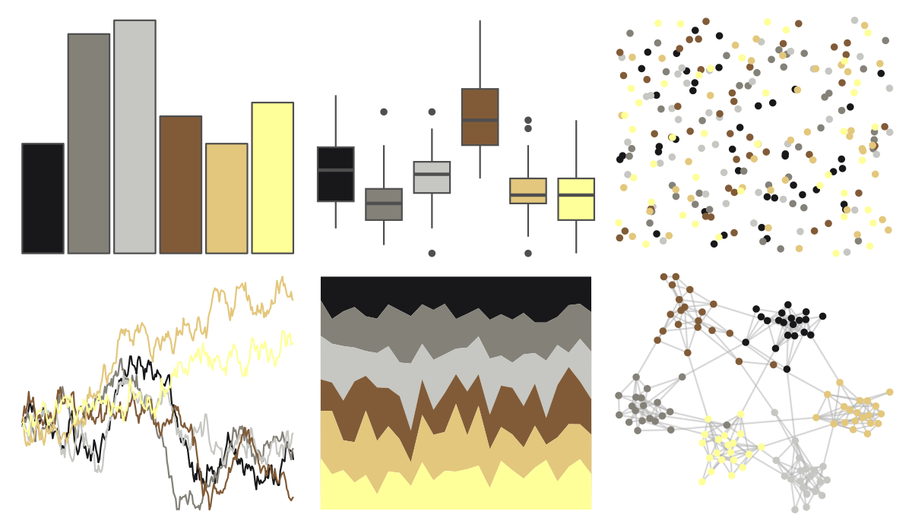

# colRoz - s_spinigerus 

::: columns
::: {.column width="50%"}

**Github**

[jacintak/colRoz](https://github.com/jacintak/colRoz)
:::

::: {.column width="50%"}

**CRAN**

Not on CRAN
:::
:::

<hr> 

Use with [paletteer](https://emilhvitfeldt.github.io/paletteer/) package:

```r
library(paletteer)
paletteer_d("colRoz::s_spinigerus")
```

Use raw:

```r
c("#18181AFF", "#848178FF", "#C6C7C2FF", "#815B37FF", "#E3C77CFF", "#FEFF99FF")
``` 

 

<br>

# Related Palettes

<div class="list" style="display: grid; grid-template-columns: auto auto auto;"> <figure class="figure">
<a href="../../awtools/a_palette/"> </a>
</figure> <figure class="figure">
<a href="../../ButterflyColors/hamadryas_feronia/"> </a>
</figure> <figure class="figure">
<a href="../../ButterflyColors/hamadryas_feronia/"> </a>
</figure> <figure class="figure">
<a href="../../yarrr/ohbrother/"> </a>
</figure> <figure class="figure">
<a href="../../colRoz/p_mitchelli/"> </a>
</figure> <figure class="figure">
<a href="../../fishualize/Acanthurus_triostegus/"> </a>
</figure> <figure class="figure">
<a href="../../Manu/Hihi/"> </a>
</figure> <figure class="figure">
<a href="../../soilpalettes/rendoll/"> </a>
</figure> <figure class="figure">
<a href="../../futurevisions/earth/"> </a>
</figure> <figure class="figure">
<a href="../../fishualize/Melichthys_vidua/"> </a>
</figure> <figure class="figure">
<a href="../../calecopal/buow/"> </a>
</figure> <figure class="figure">
<a href="../../palettetown/elekid/"> </a>
</figure> 
</div>
