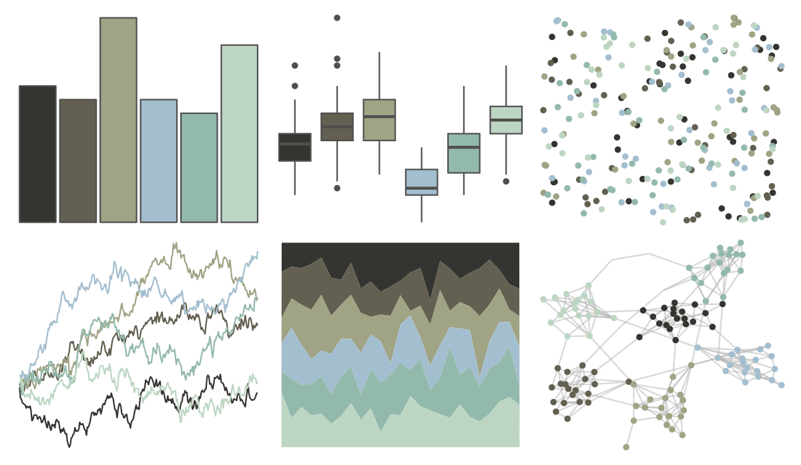

# colRoz - shark_bay 

::: columns
::: {.column width="50%"}

**Github**

[jacintak/colRoz](https://github.com/jacintak/colRoz)
:::

::: {.column width="50%"}

**CRAN**

Not on CRAN
:::
:::

<hr> 

Use with [paletteer](https://emilhvitfeldt.github.io/paletteer/) package:

```r
library(paletteer)
paletteer_d("colRoz::shark_bay")
```

Use raw:

```r
c("#343530FF", "#636051FF", "#A0A384FF", "#A3BECFFF", "#93B9ACFF", "#BDD6C3FF")
``` 

 

<br>

# Related Palettes

<div class="list" style="display: grid; grid-template-columns: auto auto auto;"> <figure class="figure">
<a href="../../awtools/a_palette/"> </a>
</figure> <figure class="figure">
<a href="../../ButterflyColors/hamadryas_feronia/"> </a>
</figure> <figure class="figure">
<a href="../../ButterflyColors/hamadryas_feronia/"> </a>
</figure> <figure class="figure">
<a href="../../lisa/SalvadorDali_1/"> </a>
</figure> <figure class="figure">
<a href="../../fishualize/Mugil_liza/"> </a>
</figure> <figure class="figure">
<a href="../../fishualize/Alosa_fallax/"> </a>
</figure> <figure class="figure">
<a href="../../fishualize/Lile_piquitinga/"> </a>
</figure> <figure class="figure">
<a href="../../calecopal/creek/"> </a>
</figure> <figure class="figure">
<a href="../../ButterflyColors/astraptes_fulgerator/"> </a>
</figure> <figure class="figure">
<a href="../../IslamicArt/fes2/"> </a>
</figure> <figure class="figure">
<a href="../../awtools/gpalette/"> </a>
</figure> <figure class="figure">
<a href="../../beyonce/X35/"> </a>
</figure> 
</div>
