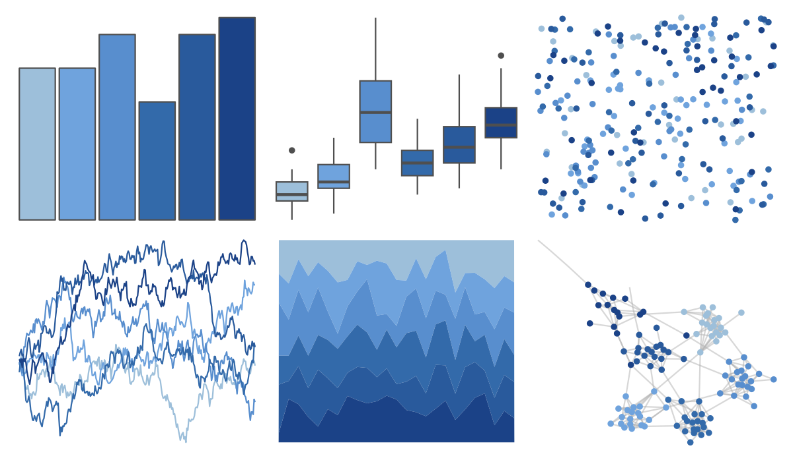

# colRoz - sky 

::: columns
::: {.column width="50%"}

**Github**

[jacintak/colRoz](https://github.com/jacintak/colRoz)
:::

::: {.column width="50%"}

**CRAN**

Not on CRAN
:::
:::

<hr> 

Use with [paletteer](https://emilhvitfeldt.github.io/paletteer/) package:

```r
library(paletteer)
paletteer_d("colRoz::sky")
```

Use raw:

```r
c("#9DBFDAFF", "#6FA3DDFF", "#588ECEFF", "#336AAAFF", "#295A9CFF", "#1B4287FF")
``` 

 

<br>

# Related Palettes

<div class="list" style="display: grid; grid-template-columns: auto auto auto;"> <figure class="figure">
<a href="../../awtools/a_palette/"> </a>
</figure> <figure class="figure">
<a href="../../calecopal/sbchannel/"> </a>
</figure> <figure class="figure">
<a href="../../unikn/pal_karpfenblau/"> </a>
</figure> <figure class="figure">
<a href="../../fishualize/Sparisoma_frondosum_m/"> </a>
</figure> <figure class="figure">
<a href="../../MetBrewer/Hokusai2/"> </a>
</figure> <figure class="figure">
<a href="../../ggsci/indigo_material/"> </a>
</figure> <figure class="figure">
<a href="../../unikn/pal_petrol/"> </a>
</figure> <figure class="figure">
<a href="../../vapeplot/jazzcup/"> </a>
</figure> <figure class="figure">
<a href="../../vapoRwave/jazzCup/"> </a>
</figure> <figure class="figure">
<a href="../../palettetown/pineco/"> </a>
</figure> <figure class="figure">
<a href="../../ggthemes/excel_Blue_Warm/"> </a>
</figure> <figure class="figure">
<a href="../../ggsci/blue_material/"> </a>
</figure> 
</div>
