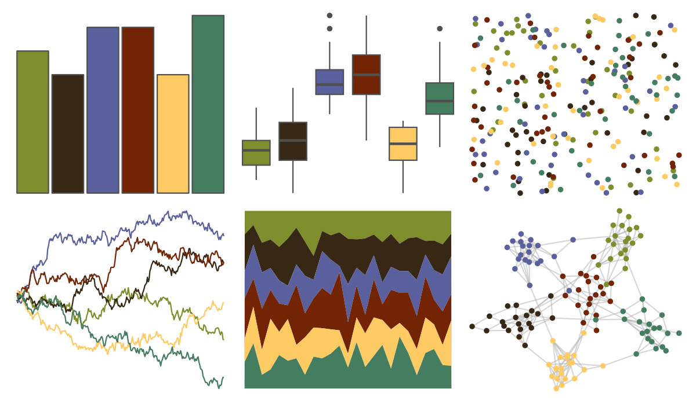

# colRoz - virgo 

::: columns
::: {.column width="50%"}

**Github**

[jacintak/colRoz](https://github.com/jacintak/colRoz)
:::

::: {.column width="50%"}

**CRAN**

Not on CRAN
:::
:::

<hr> 

Use with [paletteer](https://emilhvitfeldt.github.io/paletteer/) package:

```r
library(paletteer)
paletteer_d("colRoz::virgo")
```

Use raw:

```r
c("#7E8E2CFF", "#372815FF", "#5A5F9DFF", "#732405FF", "#FECA64FF", "#457D60FF")
``` 

 

<br>

# Related Palettes

<div class="list" style="display: grid; grid-template-columns: auto auto auto;"> <figure class="figure">
<a href="../../amerika/Dem_Ind_Rep3/"> </a>
</figure> <figure class="figure">
<a href="../../lisa/PavelTchelitchew/"> </a>
</figure> <figure class="figure">
<a href="../../lisa/JohannesVermeer_1/"> </a>
</figure> <figure class="figure">
<a href="../../waRhol/bighorn_ram_83/"> </a>
</figure> <figure class="figure">
<a href="../../MetBrewer/Juarez/"> </a>
</figure> <figure class="figure">
<a href="../../nbapalettes/mavericks_banner/"> </a>
</figure> <figure class="figure">
<a href="../../nationalparkcolors/Acadia/"> </a>
</figure> <figure class="figure">
<a href="../../khroma/mediumcontrast/"> </a>
</figure> <figure class="figure">
<a href="../../poisonfrogs/Rvariabilis/"> </a>
</figure> <figure class="figure">
<a href="../../lisa/EdvardMunch/"> </a>
</figure> <figure class="figure">
<a href="../../lisa/EdwardHopper/"> </a>
</figure> <figure class="figure">
<a href="../../MoMAColors/Ohchi/"> </a>
</figure> 
</div>
