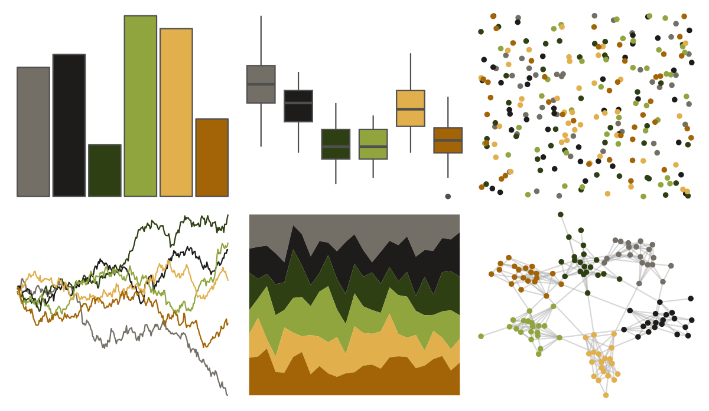

# colRoz - xantho 

::: columns
::: {.column width="50%"}

**Github**

[jacintak/colRoz](https://github.com/jacintak/colRoz)
:::

::: {.column width="50%"}

**CRAN**

Not on CRAN
:::
:::

<hr> 

Use with [paletteer](https://emilhvitfeldt.github.io/paletteer/) package:

```r
library(paletteer)
paletteer_d("colRoz::xantho")
```

Use raw:

```r
c("#736F66FF", "#1D1C1AFF", "#2E3F13FF", "#90A53EFF", "#E1AF4CFF", "#A36407FF")
``` 

 

<br>

# Related Palettes

<div class="list" style="display: grid; grid-template-columns: auto auto auto;"> <figure class="figure">
<a href="../../amerika/Dem_Ind_Rep3/"> </a>
</figure> <figure class="figure">
<a href="../../poisonfrogs/Hcinerascens/"> </a>
</figure> <figure class="figure">
<a href="../../poisonfrogs/Osotokiki/"> </a>
</figure> <figure class="figure">
<a href="../../lisa/ClaudeMonet/"> </a>
</figure> <figure class="figure">
<a href="../../lisa/FridaKahlo/"> </a>
</figure> <figure class="figure">
<a href="../../NatParksPalettes/SmokyMtns/"> </a>
</figure> <figure class="figure">
<a href="../../wesanderson/Cavalcanti1/"> </a>
</figure> <figure class="figure">
<a href="../../vangogh/CafeDeNuit/"> </a>
</figure> <figure class="figure">
<a href="../../Manu/Pohutukawa/"> </a>
</figure> <figure class="figure">
<a href="../../colRoz/k_scurra/"> </a>
</figure> <figure class="figure">
<a href="../../lisa/MiltonAvery/"> </a>
</figure> <figure class="figure">
<a href="../../beyonce/X34/"> </a>
</figure> 
</div>
