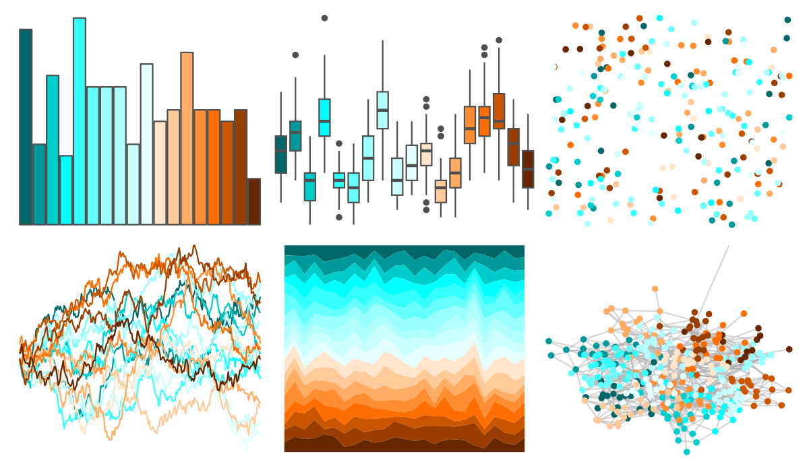

# colorBlindness - Blue2DarkOrange18Steps 

::: columns
::: {.column width="50%"}

**Github**

Not on Github
:::

::: {.column width="50%"}

**CRAN**

[colorBlindness](https://CRAN.R-project.org/package=colorBlindness)
:::
:::

<hr> 

Use with [paletteer](https://emilhvitfeldt.github.io/paletteer/) package:

```r
library(paletteer)
paletteer_d("colorBlindness::Blue2DarkOrange18Steps")
```

Use raw:

```r
c("#006666FF", "#009999FF", "#00CCCCFF", "#00FFFFFF", "#33FFFFFF", "#65FFFFFF", "#99FFFFFF", "#B2FFFFFF", "#CBFFFFFF", "#E5FFFFFF", "#FFE5CBFF", "#FFCA99FF", "#FFAD65FF", "#FF8E33FF", "#FF6E00FF", "#CC5500FF", "#993D00FF", "#662700FF")
``` 

 

<br>

# Related Palettes

<div class="list" style="display: grid; grid-template-columns: auto auto auto;"> <figure class="figure">
<a href="../../awtools/a_palette/"> </a>
</figure> <figure class="figure">
<a href="../../dichromat/BluetoDarkOrange_18/"> </a>
</figure> <figure class="figure">
<a href="../../colorBlindness/Blue2DarkOrange12Steps/"> </a>
</figure> <figure class="figure">
<a href="../../dichromat/BluetoDarkOrange_12/"> </a>
</figure> <figure class="figure">
<a href="../../dichromat/BrowntoBlue_12/"> </a>
</figure> <figure class="figure">
<a href="../../colorBlindness/Brown2Blue12Steps/"> </a>
</figure> <figure class="figure">
<a href="../../colorBlindness/Brown2Blue10Steps/"> </a>
</figure> <figure class="figure">
<a href="../../dichromat/BrowntoBlue_10/"> </a>
</figure> <figure class="figure">
<a href="../../MetBrewer/Homer1/"> </a>
</figure> <figure class="figure">
<a href="../../dichromat/BluetoOrange_8/"> </a>
</figure> <figure class="figure">
<a href="../../colorBlindness/Blue2Orange8Steps/"> </a>
</figure> <figure class="figure">
<a href="../../dichromat/BluetoOrange_10/"> </a>
</figure> 
</div>
