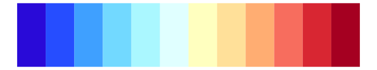
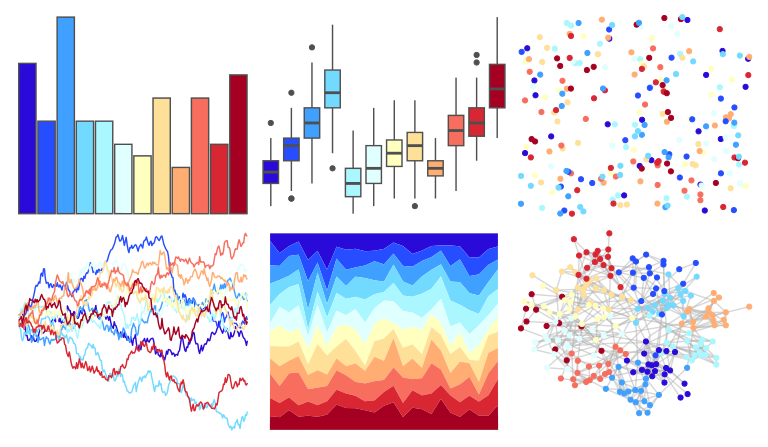
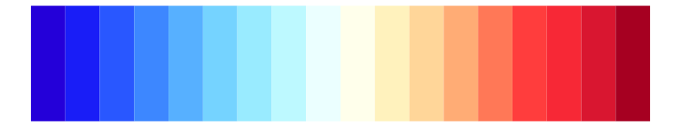
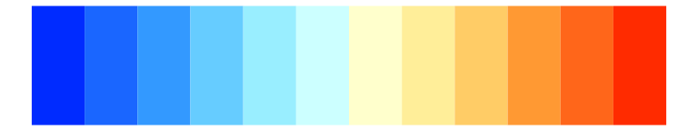
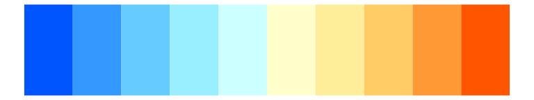

# colorBlindness - Blue2DarkRed12Steps 

::: columns
::: {.column width="50%"}

**Github**

Not on Github
:::

::: {.column width="50%"}

**CRAN**

[colorBlindness](https://CRAN.R-project.org/package=colorBlindness)
:::
:::

<hr> 

Use with [paletteer](https://emilhvitfeldt.github.io/paletteer/) package:

```r
library(paletteer)
paletteer_d("colorBlindness::Blue2DarkRed12Steps")
```

Use raw:

```r
c("#290AD8FF", "#264DFFFF", "#3FA0FFFF", "#72D9FFFF", "#AAF7FFFF", "#E0FFFFFF", "#FFFFBFFF", "#FFE099FF", "#FFAD72FF", "#F76D5EFF", "#D82632FF", "#A50021FF")
``` 

 

<br>

# Related Palettes

<div class="list" style="display: grid; grid-template-columns: auto auto auto;"> <figure class="figure">
<a href="../../awtools/a_palette/"> </a>
</figure> <figure class="figure">
<a href="../../dichromat/DarkRedtoBlue_12/"> </a>
</figure> <figure class="figure">
<a href="../../colorBlindness/ModifiedSpectralScheme11Steps/"> </a>
</figure> <figure class="figure">
<a href="../../dichromat/DarkRedtoBlue_18/"> </a>
</figure> <figure class="figure">
<a href="../../colorBlindness/Blue2DarkRed18Steps/"> </a>
</figure> <figure class="figure">
<a href="../../RColorBrewer/RdYlBu/"> </a>
</figure> <figure class="figure">
<a href="../../colorBlindness/Blue2Orange12Steps/"> </a>
</figure> <figure class="figure">
<a href="../../dichromat/BluetoOrange_12/"> </a>
</figure> <figure class="figure">
<a href="../../khroma/sunset/"> </a>
</figure> <figure class="figure">
<a href="../../RColorBrewer/Spectral/"> </a>
</figure> <figure class="figure">
<a href="../../colorBlindness/Blue2Orange10Steps/"> </a>
</figure> <figure class="figure">
<a href="../../dichromat/BluetoOrange_10/"> </a>
</figure> 
</div>
