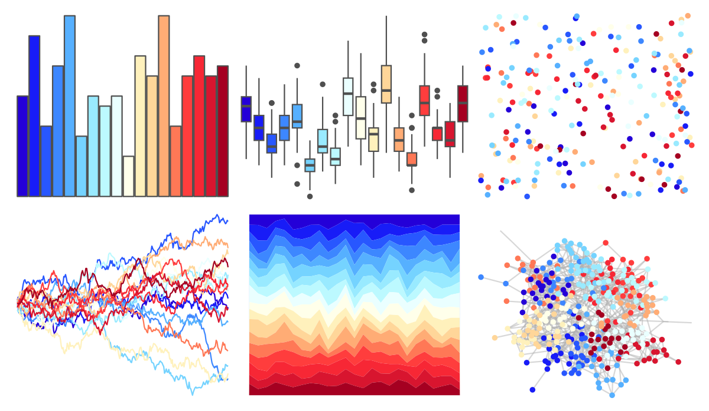
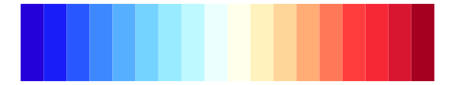

# colorBlindness - Blue2DarkRed18Steps 

::: columns
::: {.column width="50%"}

**Github**

Not on Github
:::

::: {.column width="50%"}

**CRAN**

[colorBlindness](https://CRAN.R-project.org/package=colorBlindness)
:::
:::

<hr> 

Use with [paletteer](https://emilhvitfeldt.github.io/paletteer/) package:

```r
library(paletteer)
paletteer_d("colorBlindness::Blue2DarkRed18Steps")
```

Use raw:

```r
c("#2400D8FF", "#181CF7FF", "#2857FFFF", "#3D87FFFF", "#56B0FFFF", "#75D3FFFF", "#99EAFFFF", "#BCF9FFFF", "#EAFFFFFF", "#FFFFEAFF", "#FFF1BCFF", "#FFD699FF", "#FFAC75FF", "#FF7856FF", "#FF3D3DFF", "#F72735FF", "#D8152FFF", "#A50021FF")
``` 

 

<br>

# Related Palettes

<div class="list" style="display: grid; grid-template-columns: auto auto auto;"> <figure class="figure">
<a href="../../amerika/Dem_Ind_Rep3/"> </a>
</figure> <figure class="figure">
<a href="../../dichromat/DarkRedtoBlue_18/"> </a>
</figure> <figure class="figure">
<a href="../../dichromat/DarkRedtoBlue_12/"> </a>
</figure> <figure class="figure">
<a href="../../colorBlindness/Blue2DarkRed12Steps/"> </a>
</figure> <figure class="figure">
<a href="../../colorBlindness/ModifiedSpectralScheme11Steps/"> </a>
</figure> <figure class="figure">
<a href="../../dichromat/BluetoOrange_12/"> </a>
</figure> <figure class="figure">
<a href="../../colorBlindness/Blue2Orange12Steps/"> </a>
</figure> <figure class="figure">
<a href="../../RColorBrewer/RdYlBu/"> </a>
</figure> <figure class="figure">
<a href="../../khroma/sunset/"> </a>
</figure> <figure class="figure">
<a href="../../colorBlindness/Blue2OrangeRed14Steps/"> </a>
</figure> <figure class="figure">
<a href="../../dichromat/BluetoOrangeRed_14/"> </a>
</figure> <figure class="figure">
<a href="../../colorBlindness/Blue2Orange10Steps/"> </a>
</figure> 
</div>
