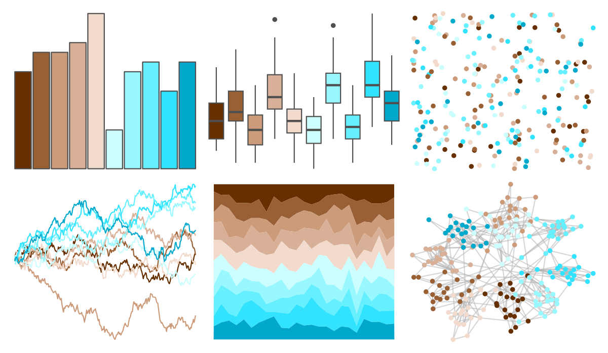

# colorBlindness - Brown2Blue10Steps 

::: columns
::: {.column width="50%"}

**Github**

Not on Github
:::

::: {.column width="50%"}

**CRAN**

[colorBlindness](https://CRAN.R-project.org/package=colorBlindness)
:::
:::

<hr> 

Use with [paletteer](https://emilhvitfeldt.github.io/paletteer/) package:

```r
library(paletteer)
paletteer_d("colorBlindness::Brown2Blue10Steps")
```

Use raw:

```r
c("#662F00FF", "#996035FF", "#CC9B7AFF", "#D8AF97FF", "#F2DACDFF", "#CCFDFFFF", "#99F8FFFF", "#65EFFFFF", "#32E3FFFF", "#00A9CCFF")
``` 

 

<br>

# Related Palettes

<div class="list" style="display: grid; grid-template-columns: auto auto auto;"> <figure class="figure">
<a href="../../awtools/a_palette/"> </a>
</figure> <figure class="figure">
<a href="../../dichromat/BrowntoBlue_10/"> </a>
</figure> <figure class="figure">
<a href="../../dichromat/BluetoDarkOrange_12/"> </a>
</figure> <figure class="figure">
<a href="../../colorBlindness/Blue2DarkOrange12Steps/"> </a>
</figure> <figure class="figure">
<a href="../../dichromat/BrowntoBlue_12/"> </a>
</figure> <figure class="figure">
<a href="../../colorBlindness/Brown2Blue12Steps/"> </a>
</figure> <figure class="figure">
<a href="../../Redmonder/dPBIRdGn/"> </a>
</figure> <figure class="figure">
<a href="../../RColorBrewer/BrBG/"> </a>
</figure> <figure class="figure">
<a href="../../werpals/mountcook/"> </a>
</figure> <figure class="figure">
<a href="../../MetBrewer/Homer1/"> </a>
</figure> <figure class="figure">
<a href="../../unikn/pal_unikn_light/"> </a>
</figure> <figure class="figure">
<a href="../../ggthemes/Summer/"> </a>
</figure> 
</div>
