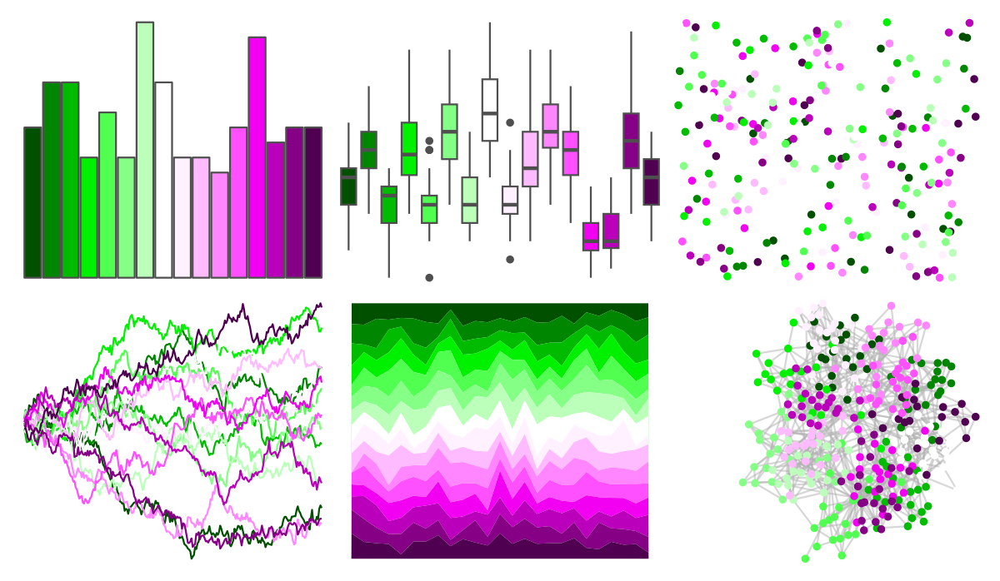
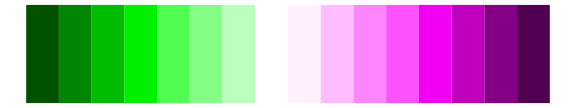
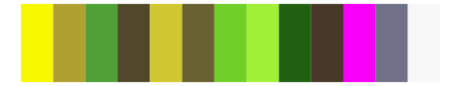

# colorBlindness - Green2Magenta16Steps 

::: columns
::: {.column width="50%"}

**Github**

Not on Github
:::

::: {.column width="50%"}

**CRAN**

[colorBlindness](https://CRAN.R-project.org/package=colorBlindness)
:::
:::

<hr> 

Use with [paletteer](https://emilhvitfeldt.github.io/paletteer/) package:

```r
library(paletteer)
paletteer_d("colorBlindness::Green2Magenta16Steps")
```

Use raw:

```r
c("#005000FF", "#008600FF", "#00BB00FF", "#00F100FF", "#50FF50FF", "#86FF86FF", "#BBFFBBFF", "#FFFFFFFF", "#FFF1FFFF", "#FFBBFFFF", "#FF86FFFF", "#FF50FFFF", "#F100F1FF", "#BB00BBFF", "#860086FF", "#500050FF")
``` 

 

<br>

# Related Palettes

<div class="list" style="display: grid; grid-template-columns: auto auto auto;"> <figure class="figure">
<a href="../../awtools/a_palette/"> </a>
</figure> <figure class="figure">
<a href="../../dichromat/GreentoMagenta_16/"> </a>
</figure> <figure class="figure">
<a href="../../RColorBrewer/PRGn/"> </a>
</figure> <figure class="figure">
<a href="../../RColorBrewer/PiYG/"> </a>
</figure> <figure class="figure">
<a href="../../colorBlindness/paletteMartin/"> </a>
</figure> <figure class="figure">
<a href="../../beyonce/X96/"> </a>
</figure> <figure class="figure">
<a href="../../palettetown/roselia/"> </a>
</figure> <figure class="figure">
<a href="../../tvthemes/Diamonds/"> </a>
</figure> <figure class="figure">
<a href="../../palettetown/sunkern/"> </a>
</figure> <figure class="figure">
<a href="../../palettetown/aipom/"> </a>
</figure> <figure class="figure">
<a href="../../tvthemes/rickAndMorty/"> </a>
</figure> <figure class="figure">
<a href="../../palettetown/nidoking/"> </a>
</figure> 
</div>
