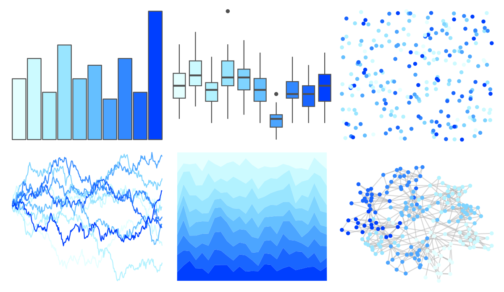

# colorBlindness - LightBlue2DarkBlue10Steps 

::: columns
::: {.column width="50%"}

**Github**

Not on Github
:::

::: {.column width="50%"}

**CRAN**

[colorBlindness](https://CRAN.R-project.org/package=colorBlindness)
:::
:::

<hr> 

Use with [paletteer](https://emilhvitfeldt.github.io/paletteer/) package:

```r
library(paletteer)
paletteer_d("colorBlindness::LightBlue2DarkBlue10Steps")
```

Use raw:

```r
c("#E5FFFFFF", "#CCFAFFFF", "#B2F2FFFF", "#99E5FFFF", "#7FD4FFFF", "#65BFFFFF", "#4CA5FFFF", "#3288FFFF", "#1965FFFF", "#003FFFFF")
``` 

 

<br>

# Related Palettes

<div class="list" style="display: grid; grid-template-columns: auto auto auto;"> <figure class="figure">
<a href="../../amerika/Dem_Ind_Rep3/"> </a>
</figure> <figure class="figure">
<a href="../../dichromat/LightBluetoDarkBlue_10/"> </a>
</figure> <figure class="figure">
<a href="../../ggsci/blue_material/"> </a>
</figure> <figure class="figure">
<a href="../../ggsci/light_blue_material/"> </a>
</figure> <figure class="figure">
<a href="../../grDevices/blues9/"> </a>
</figure> <figure class="figure">
<a href="../../RColorBrewer/Blues/"> </a>
</figure> <figure class="figure">
<a href="../../ggsci/sky_tw3/"> </a>
</figure> <figure class="figure">
<a href="../../ggsci/cyan_tw3/"> </a>
</figure> <figure class="figure">
<a href="../../ggprism/winter_soft/"> </a>
</figure> <figure class="figure">
<a href="../../ggsci/blue_tw3/"> </a>
</figure> <figure class="figure">
<a href="../../unikn/pal_seeblau/"> </a>
</figure> <figure class="figure">
<a href="../../LaCroixColoR/Pure/"> </a>
</figure> 
</div>
