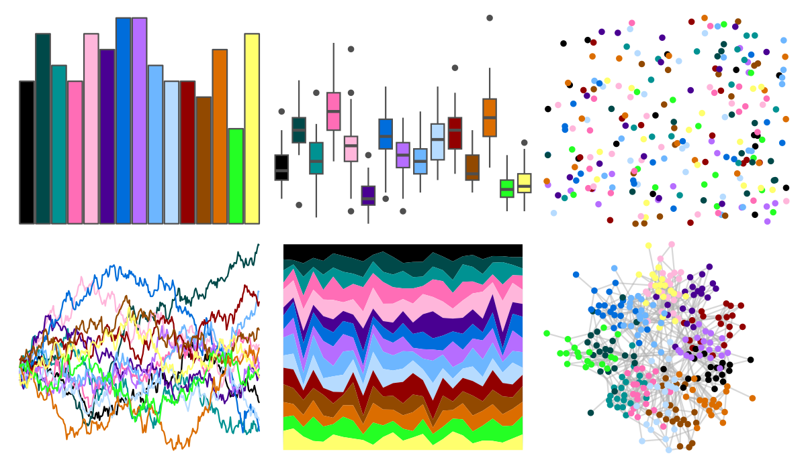
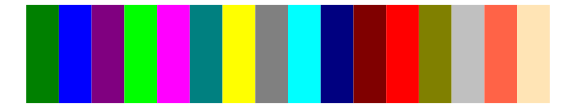

# colorBlindness - paletteMartin 

::: columns
::: {.column width="50%"}

**Github**

Not on Github
:::

::: {.column width="50%"}

**CRAN**

[colorBlindness](https://CRAN.R-project.org/package=colorBlindness)
:::
:::

<hr> 

Use with [paletteer](https://emilhvitfeldt.github.io/paletteer/) package:

```r
library(paletteer)
paletteer_d("colorBlindness::paletteMartin")
```

Use raw:

```r
c("#000000FF", "#004949FF", "#009292FF", "#FF6DB6FF", "#FFB6DBFF", "#490092FF", "#006DDBFF", "#B66DFFFF", "#6DB6FFFF", "#B6DBFFFF", "#920000FF", "#924900FF", "#DB6D00FF", "#24FF24FF", "#FFFF6DFF")
``` 

 

<br>

# Related Palettes

<div class="list" style="display: grid; grid-template-columns: auto auto auto;"> <figure class="figure">
<a href="../../awtools/a_palette/"> </a>
</figure> <figure class="figure">
<a href="../../ButterflyColors/hamadryas_feronia/"> </a>
</figure> <figure class="figure">
<a href="../../ButterflyColors/hamadryas_feronia/"> </a>
</figure> <figure class="figure">
<a href="../../awtools/bpalette/"> </a>
</figure> <figure class="figure">
<a href="../../pals/watlington/"> </a>
</figure> <figure class="figure">
<a href="../../jcolors/rainbow/"> </a>
</figure> <figure class="figure">
<a href="../../ggprism/colors/"> </a>
</figure> <figure class="figure">
<a href="../../rcartocolor/Bold/"> </a>
</figure> <figure class="figure">
<a href="../../werpals/benagil/"> </a>
</figure> <figure class="figure">
<a href="../../miscpalettes/bright/"> </a>
</figure> <figure class="figure">
<a href="../../palettesForR/Android/"> </a>
</figure> <figure class="figure">
<a href="../../palettetown/roselia/"> </a>
</figure> 
</div>
