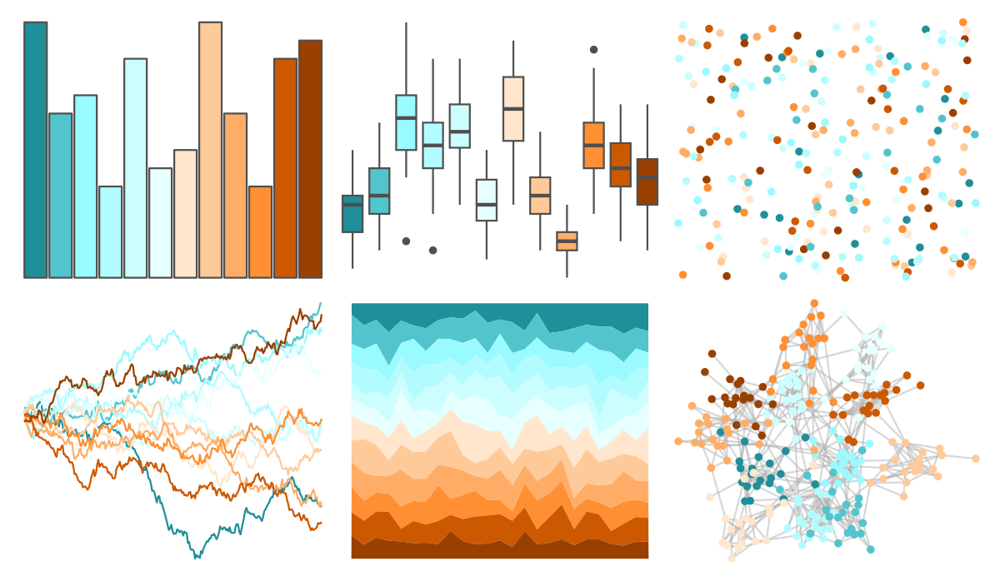

# dichromat - BluetoDarkOrange_12 

::: columns
::: {.column width="50%"}

**Github**

Not on Github
:::

::: {.column width="50%"}

**CRAN**

[dichromat](https://CRAN.R-project.org/package=dichromat)
:::
:::

<hr> 

Use with [paletteer](https://emilhvitfeldt.github.io/paletteer/) package:

```r
library(paletteer)
paletteer_d("dichromat::BluetoDarkOrange_12")
```

Use raw:

```r
c("#1F8F99FF", "#52C4CCFF", "#99FAFFFF", "#B2FCFFFF", "#CCFEFFFF", "#E6FFFFFF", "#FFE6CCFF", "#FFCA99FF", "#FFAD66FF", "#FF8F33FF", "#CC5800FF", "#994000FF")
``` 

 

<br>

# Related Palettes

<div class="list" style="display: grid; grid-template-columns: auto auto auto;"> <figure class="figure">
<a href="../../awtools/a_palette/"> </a>
</figure> <figure class="figure">
<a href="../../ButterflyColors/hamadryas_feronia/"> </a>
</figure> <figure class="figure">
<a href="../../ButterflyColors/hamadryas_feronia/"> </a>
</figure> <figure class="figure">
<a href="../../colorBlindness/Blue2DarkOrange12Steps/"> </a>
</figure> <figure class="figure">
<a href="../../colorBlindness/Brown2Blue10Steps/"> </a>
</figure> <figure class="figure">
<a href="../../dichromat/BrowntoBlue_10/"> </a>
</figure> <figure class="figure">
<a href="../../dichromat/BluetoDarkOrange_18/"> </a>
</figure> <figure class="figure">
<a href="../../colorBlindness/Blue2DarkOrange18Steps/"> </a>
</figure> <figure class="figure">
<a href="../../ggthemes/Jewel_Bright/"> </a>
</figure> <figure class="figure">
<a href="../../MetBrewer/Hiroshige/"> </a>
</figure> <figure class="figure">
<a href="../../dichromat/BrowntoBlue_12/"> </a>
</figure> <figure class="figure">
<a href="../../colorBlindness/Brown2Blue12Steps/"> </a>
</figure> 
</div>
