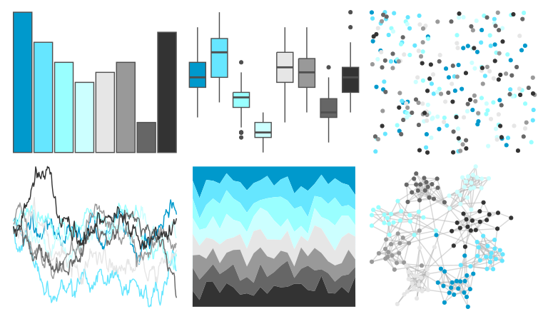

# dichromat - BluetoGray_8 

::: columns
::: {.column width="50%"}

**Github**

Not on Github
:::

::: {.column width="50%"}

**CRAN**

[dichromat](https://CRAN.R-project.org/package=dichromat)
:::
:::

<hr> 

Use with [paletteer](https://emilhvitfeldt.github.io/paletteer/) package:

```r
library(paletteer)
paletteer_d("dichromat::BluetoGray_8")
```

Use raw:

```r
c("#0099CCFF", "#66E6FFFF", "#99FFFFFF", "#CCFFFFFF", "#E6E6E6FF", "#999999FF", "#666666FF", "#333333FF")
``` 

 

<br>

# Related Palettes

<div class="list" style="display: grid; grid-template-columns: auto auto auto;"> <figure class="figure">
<a href="../../awtools/a_palette/"> </a>
</figure> <figure class="figure">
<a href="../../colorBlindness/Blue2Gray8Steps/"> </a>
</figure> <figure class="figure">
<a href="../../werpals/mountcook/"> </a>
</figure> <figure class="figure">
<a href="../../calecopal/lake/"> </a>
</figure> <figure class="figure">
<a href="../../Redmonder/dPBIPuGn/"> </a>
</figure> <figure class="figure">
<a href="../../unikn/pal_unikn_light/"> </a>
</figure> <figure class="figure">
<a href="../../ggthemes/Nuriel_Stone/"> </a>
</figure> <figure class="figure">
<a href="../../nationalparkcolors/GreatBasin/"> </a>
</figure> <figure class="figure">
<a href="../../DresdenColor/colddays/"> </a>
</figure> <figure class="figure">
<a href="../../palettetown/tyranitar/"> </a>
</figure> <figure class="figure">
<a href="../../Redmonder/dPBIRdGn/"> </a>
</figure> <figure class="figure">
<a href="../../beyonce/X129/"> </a>
</figure> 
</div>
