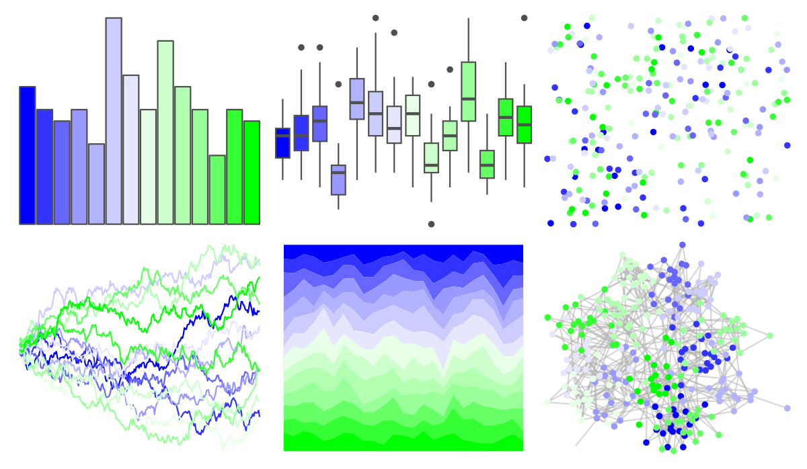
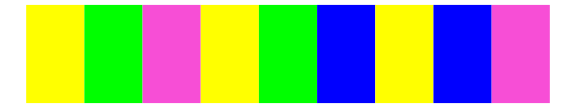

# dichromat - BluetoGreen_14 

::: columns
::: {.column width="50%"}

**Github**

Not on Github
:::

::: {.column width="50%"}

**CRAN**

[dichromat](https://CRAN.R-project.org/package=dichromat)
:::
:::

<hr> 

Use with [paletteer](https://emilhvitfeldt.github.io/paletteer/) package:

```r
library(paletteer)
paletteer_d("dichromat::BluetoGreen_14")
```

Use raw:

```r
c("#0000FFFF", "#3333FFFF", "#6666FFFF", "#9999FFFF", "#B2B2FFFF", "#CCCCFFFF", "#E6E6FFFF", "#E6FFE6FF", "#CCFFCCFF", "#B2FFB2FF", "#99FF99FF", "#66FF66FF", "#33FF33FF", "#00FF00FF")
``` 

 

<br>

# Related Palettes

<div class="list" style="display: grid; grid-template-columns: auto auto auto;"> <figure class="figure">
<a href="../../awtools/a_palette/"> </a>
</figure> <figure class="figure">
<a href="../../ButterflyColors/hamadryas_feronia/"> </a>
</figure> <figure class="figure">
<a href="../../ButterflyColors/hamadryas_feronia/"> </a>
</figure> <figure class="figure">
<a href="../../colorBlindness/Blue2Green14Steps/"> </a>
</figure> <figure class="figure">
<a href="../../Redmonder/qMSOBu/"> </a>
</figure> <figure class="figure">
<a href="../../dichromat/LightBluetoDarkBlue_10/"> </a>
</figure> <figure class="figure">
<a href="../../colorBlindness/LightBlue2DarkBlue10Steps/"> </a>
</figure> <figure class="figure">
<a href="../../ggprism/neon/"> </a>
</figure> <figure class="figure">
<a href="../../RColorBrewer/YlGnBu/"> </a>
</figure> <figure class="figure">
<a href="../../trekcolors/lcars_23c/"> </a>
</figure> <figure class="figure">
<a href="../../RColorBrewer/GnBu/"> </a>
</figure> <figure class="figure">
<a href="../../tvthemes/Emerald/"> </a>
</figure> 
</div>
