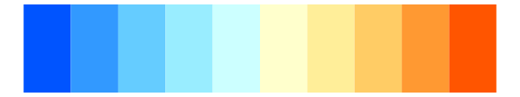

# dichromat - BluetoOrange_12 

::: columns
::: {.column width="50%"}

**Github**

Not on Github
:::

::: {.column width="50%"}

**CRAN**

[dichromat](https://CRAN.R-project.org/package=dichromat)
:::
:::

<hr> 

Use with [paletteer](https://emilhvitfeldt.github.io/paletteer/) package:

```r
library(paletteer)
paletteer_d("dichromat::BluetoOrange_12")
```

Use raw:

```r
c("#002BFFFF", "#1A66FFFF", "#3399FFFF", "#66CCFFFF", "#99EEFFFF", "#CCFFFFFF", "#FFFFCCFF", "#FFEE99FF", "#FFCC66FF", "#FF9933FF", "#FF661AFF", "#FF2B00FF")
``` 

 

<br>

# Related Palettes

<div class="list" style="display: grid; grid-template-columns: auto auto auto;"> <figure class="figure">
<a href="../../awtools/a_palette/"> </a>
</figure> <figure class="figure">
<a href="../../colorBlindness/Blue2Orange12Steps/"> </a>
</figure> <figure class="figure">
<a href="../../colorBlindness/Blue2Orange10Steps/"> </a>
</figure> <figure class="figure">
<a href="../../dichromat/BluetoOrange_10/"> </a>
</figure> <figure class="figure">
<a href="../../colorBlindness/ModifiedSpectralScheme11Steps/"> </a>
</figure> <figure class="figure">
<a href="../../colorBlindness/Blue2OrangeRed14Steps/"> </a>
</figure> <figure class="figure">
<a href="../../dichromat/BluetoOrangeRed_14/"> </a>
</figure> <figure class="figure">
<a href="../../dichromat/DarkRedtoBlue_12/"> </a>
</figure> <figure class="figure">
<a href="../../colorBlindness/Blue2DarkRed12Steps/"> </a>
</figure> <figure class="figure">
<a href="../../colorBlindness/Blue2DarkRed18Steps/"> </a>
</figure> <figure class="figure">
<a href="../../dichromat/DarkRedtoBlue_18/"> </a>
</figure> <figure class="figure">
<a href="../../RColorBrewer/RdYlBu/"> </a>
</figure> 
</div>
