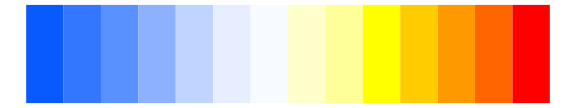
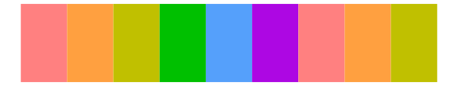

# dichromat - Categorical_12 

::: columns
::: {.column width="50%"}

**Github**

Not on Github
:::

::: {.column width="50%"}

**CRAN**

[dichromat](https://CRAN.R-project.org/package=dichromat)
:::
:::

<hr> 

Use with [paletteer](https://emilhvitfeldt.github.io/paletteer/) package:

```r
library(paletteer)
paletteer_d("dichromat::Categorical_12")
```

Use raw:

```r
c("#FFBF80FF", "#FF8000FF", "#FFFF99FF", "#FFFF33FF", "#B2FF8CFF", "#33FF00FF", "#A6EDFFFF", "#1AB2FFFF", "#CCBFFFFF", "#664CFFFF", "#FF99BFFF", "#E61A33FF")
``` 

 

<br>

# Related Palettes

<div class="list" style="display: grid; grid-template-columns: auto auto auto;"> <figure class="figure">
<a href="../../awtools/a_palette/"> </a>
</figure> <figure class="figure">
<a href="../../colorBlindness/PairedColor12Steps/"> </a>
</figure> <figure class="figure">
<a href="../../colorBlindness/Blue2OrangeRed14Steps/"> </a>
</figure> <figure class="figure">
<a href="../../dichromat/BluetoOrangeRed_14/"> </a>
</figure> <figure class="figure">
<a href="../../colorBlindness/Blue2Orange10Steps/"> </a>
</figure> <figure class="figure">
<a href="../../dichromat/BluetoOrange_10/"> </a>
</figure> <figure class="figure">
<a href="../../tidyquant/tq_dark/"> </a>
</figure> <figure class="figure">
<a href="../../colorBlindness/Blue2Orange12Steps/"> </a>
</figure> <figure class="figure">
<a href="../../dichromat/BluetoOrange_12/"> </a>
</figure> <figure class="figure">
<a href="../../RColorBrewer/Paired/"> </a>
</figure> <figure class="figure">
<a href="../../ggprism/candy_soft/"> </a>
</figure> <figure class="figure">
<a href="../../RColorBrewer/Spectral/"> </a>
</figure> 
</div>
