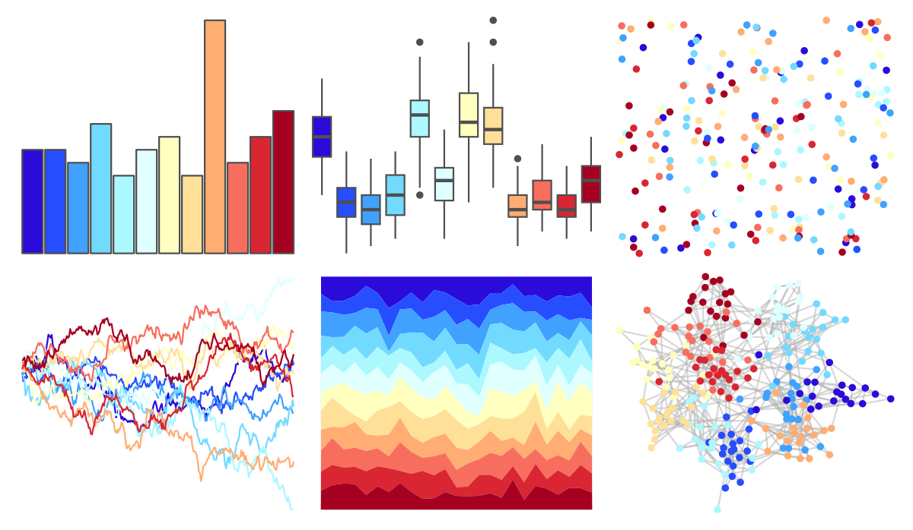

# dichromat - DarkRedtoBlue_12 

::: columns
::: {.column width="50%"}

**Github**

Not on Github
:::

::: {.column width="50%"}

**CRAN**

[dichromat](https://CRAN.R-project.org/package=dichromat)
:::
:::

<hr> 

Use with [paletteer](https://emilhvitfeldt.github.io/paletteer/) package:

```r
library(paletteer)
paletteer_d("dichromat::DarkRedtoBlue_12")
```

Use raw:

```r
c("#2A0BD9FF", "#264EFFFF", "#40A1FFFF", "#73DAFFFF", "#ABF8FFFF", "#E0FFFFFF", "#FFFFBFFF", "#FFE099FF", "#FFAD73FF", "#F76E5EFF", "#D92632FF", "#A60021FF")
``` 

 

<br>

# Related Palettes

<div class="list" style="display: grid; grid-template-columns: auto auto auto;"> <figure class="figure">
<a href="../../amerika/Dem_Ind_Rep3/"> </a>
</figure> <figure class="figure">
<a href="../../colorBlindness/Blue2DarkRed12Steps/"> </a>
</figure> <figure class="figure">
<a href="../../colorBlindness/ModifiedSpectralScheme11Steps/"> </a>
</figure> <figure class="figure">
<a href="../../dichromat/DarkRedtoBlue_18/"> </a>
</figure> <figure class="figure">
<a href="../../colorBlindness/Blue2DarkRed18Steps/"> </a>
</figure> <figure class="figure">
<a href="../../RColorBrewer/RdYlBu/"> </a>
</figure> <figure class="figure">
<a href="../../colorBlindness/Blue2Orange12Steps/"> </a>
</figure> <figure class="figure">
<a href="../../dichromat/BluetoOrange_12/"> </a>
</figure> <figure class="figure">
<a href="../../khroma/sunset/"> </a>
</figure> <figure class="figure">
<a href="../../RColorBrewer/Spectral/"> </a>
</figure> <figure class="figure">
<a href="../../colorBlindness/Blue2Orange10Steps/"> </a>
</figure> <figure class="figure">
<a href="../../dichromat/BluetoOrange_10/"> </a>
</figure> 
</div>
