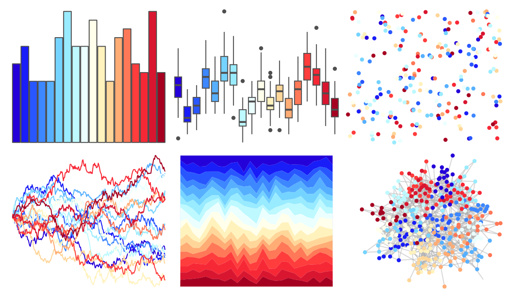

# dichromat - DarkRedtoBlue_18 

::: columns
::: {.column width="50%"}

**Github**

Not on Github
:::

::: {.column width="50%"}

**CRAN**

[dichromat](https://CRAN.R-project.org/package=dichromat)
:::
:::

<hr> 

Use with [paletteer](https://emilhvitfeldt.github.io/paletteer/) package:

```r
library(paletteer)
paletteer_d("dichromat::DarkRedtoBlue_18")
```

Use raw:

```r
c("#2400D9FF", "#191DF7FF", "#2957FFFF", "#3D87FFFF", "#57B0FFFF", "#75D3FFFF", "#99EBFFFF", "#BDF9FFFF", "#EBFFFFFF", "#FFFFEBFF", "#FFF2BDFF", "#FFD699FF", "#FFAC75FF", "#FF7857FF", "#FF3D3DFF", "#F72836FF", "#D91630FF", "#A60021FF")
``` 

 

<br>

# Related Palettes

<div class="list" style="display: grid; grid-template-columns: auto auto auto;"> <figure class="figure">
<a href="../../awtools/a_palette/"> </a>
</figure> <figure class="figure">
<a href="../../ButterflyColors/hamadryas_feronia/"> </a>
</figure> <figure class="figure">
<a href="../../ButterflyColors/hamadryas_feronia/"> </a>
</figure> <figure class="figure">
<a href="../../colorBlindness/Blue2DarkRed18Steps/"> </a>
</figure> <figure class="figure">
<a href="../../dichromat/DarkRedtoBlue_12/"> </a>
</figure> <figure class="figure">
<a href="../../colorBlindness/Blue2DarkRed12Steps/"> </a>
</figure> <figure class="figure">
<a href="../../colorBlindness/ModifiedSpectralScheme11Steps/"> </a>
</figure> <figure class="figure">
<a href="../../dichromat/BluetoOrange_12/"> </a>
</figure> <figure class="figure">
<a href="../../colorBlindness/Blue2Orange12Steps/"> </a>
</figure> <figure class="figure">
<a href="../../RColorBrewer/RdYlBu/"> </a>
</figure> <figure class="figure">
<a href="../../khroma/sunset/"> </a>
</figure> <figure class="figure">
<a href="../../colorBlindness/Blue2OrangeRed14Steps/"> </a>
</figure> 
</div>
