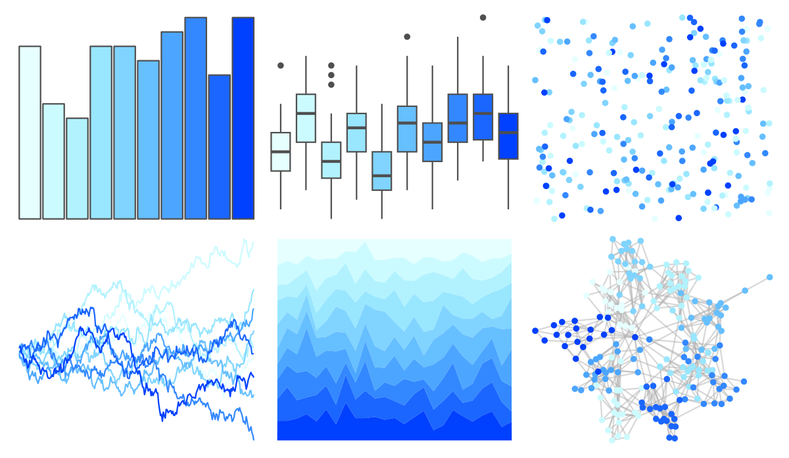

# dichromat - LightBluetoDarkBlue_10 

::: columns
::: {.column width="50%"}

**Github**

Not on Github
:::

::: {.column width="50%"}

**CRAN**

[dichromat](https://CRAN.R-project.org/package=dichromat)
:::
:::

<hr> 

Use with [paletteer](https://emilhvitfeldt.github.io/paletteer/) package:

```r
library(paletteer)
paletteer_d("dichromat::LightBluetoDarkBlue_10")
```

Use raw:

```r
c("#E6FFFFFF", "#CCFBFFFF", "#B2F2FFFF", "#99E6FFFF", "#80D4FFFF", "#66BFFFFF", "#4CA6FFFF", "#3388FFFF", "#1A66FFFF", "#0040FFFF")
``` 

 

<br>

# Related Palettes

<div class="list" style="display: grid; grid-template-columns: auto auto auto;"> <figure class="figure">
<a href="../../awtools/a_palette/"> </a>
</figure> <figure class="figure">
<a href="../../colorBlindness/LightBlue2DarkBlue10Steps/"> </a>
</figure> <figure class="figure">
<a href="../../ggsci/blue_material/"> </a>
</figure> <figure class="figure">
<a href="../../ggsci/light_blue_material/"> </a>
</figure> <figure class="figure">
<a href="../../grDevices/blues9/"> </a>
</figure> <figure class="figure">
<a href="../../RColorBrewer/Blues/"> </a>
</figure> <figure class="figure">
<a href="../../ggprism/winter_soft/"> </a>
</figure> <figure class="figure">
<a href="../../LaCroixColoR/Pure/"> </a>
</figure> <figure class="figure">
<a href="../../unikn/pal_seeblau/"> </a>
</figure> <figure class="figure">
<a href="../../ggsci/cyan_material/"> </a>
</figure> <figure class="figure">
<a href="../../fishualize/Halichoeres_brasiliensis/"> </a>
</figure> <figure class="figure">
<a href="../../fishualize/Prionace_glauca/"> </a>
</figure> 
</div>
