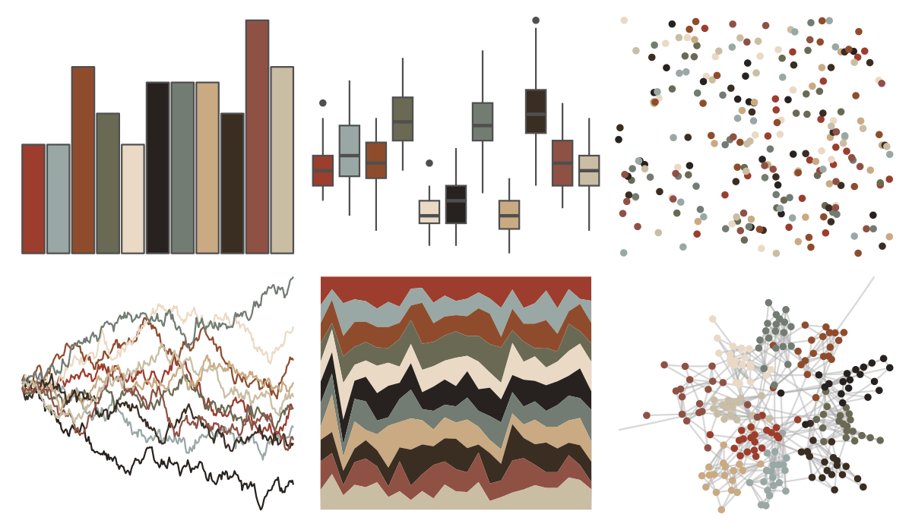
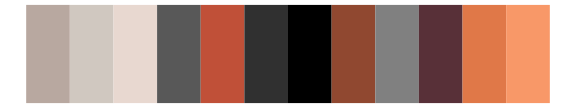

# dutchmasters - little_street 

::: columns
::: {.column width="50%"}

**Github**

[EdwinTh/dutchmasters](https://github.com/EdwinTh/dutchmasters)
:::

::: {.column width="50%"}

**CRAN**

Not on CRAN
:::
:::

<hr> 

Use with [paletteer](https://emilhvitfeldt.github.io/paletteer/) package:

```r
library(paletteer)
paletteer_d("dutchmasters::little_street")
```

Use raw:

```r
c("#9D3D2DFF", "#99A8A5FF", "#8F4C2DFF", "#6A6A54FF", "#EADAC5FF", "#27221FFF", "#727C73FF", "#C9AA82FF", "#3A2D22FF", "#8F5144FF", "#C9BDA3FF")
``` 

 

<br>

# Related Palettes

<div class="list" style="display: grid; grid-template-columns: auto auto auto;"> <figure class="figure">
<a href="../../awtools/a_palette/"> </a>
</figure> <figure class="figure">
<a href="../../peRReo/daddy1/"> </a>
</figure> <figure class="figure">
<a href="../../feathers/oriole/"> </a>
</figure> <figure class="figure">
<a href="../../palettetown/relicanth/"> </a>
</figure> <figure class="figure">
<a href="../../palettetown/torkoal/"> </a>
</figure> <figure class="figure">
<a href="../../dutchmasters/anatomy/"> </a>
</figure> <figure class="figure">
<a href="../../lisa/LucianFreud/"> </a>
</figure> <figure class="figure">
<a href="../../impressionist.colors/le_dejeuner_des_canotiers/"> </a>
</figure> <figure class="figure">
<a href="../../palettetown/nincada/"> </a>
</figure> <figure class="figure">
<a href="../../palettetown/houndour/"> </a>
</figure> <figure class="figure">
<a href="../../impressionist.colors/vahine_no_te_tiare/"> </a>
</figure> <figure class="figure">
<a href="../../palettetown/linoone/"> </a>
</figure> 
</div>
