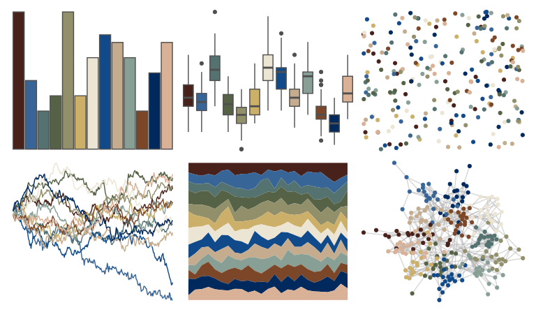

# dutchmasters - milkmaid 

::: columns
::: {.column width="50%"}

**Github**

[EdwinTh/dutchmasters](https://github.com/EdwinTh/dutchmasters)
:::

::: {.column width="50%"}

**CRAN**

Not on CRAN
:::
:::

<hr> 

Use with [paletteer](https://emilhvitfeldt.github.io/paletteer/) package:

```r
library(paletteer)
paletteer_d("dutchmasters::milkmaid")
```

Use raw:

```r
c("#48211AFF", "#376597FF", "#537270FF", "#556246FF", "#928F6BFF", "#CCAF69FF", "#ECE5D3FF", "#104A8AFF", "#C5AC8EFF", "#889F95FF", "#7C4728FF", "#00295DFF", "#D9B196FF")
``` 

 

<br>

# Related Palettes

<div class="list" style="display: grid; grid-template-columns: auto auto auto;"> <figure class="figure">
<a href="../../awtools/a_palette/"> </a>
</figure> <figure class="figure">
<a href="../../ochRe/olsen_seq/"> </a>
</figure> <figure class="figure">
<a href="../../ggthemes/stata_s2color/"> </a>
</figure> <figure class="figure">
<a href="../../ggthemes/stata_economist/"> </a>
</figure> <figure class="figure">
<a href="../../palettetown/swampert/"> </a>
</figure> <figure class="figure">
<a href="../../beyonce/X75/"> </a>
</figure> <figure class="figure">
<a href="../../MetBrewer/Redon/"> </a>
</figure> <figure class="figure">
<a href="../../palettetown/wingull/"> </a>
</figure> <figure class="figure">
<a href="../../palettetown/lapras/"> </a>
</figure> <figure class="figure">
<a href="../../palettetown/slaking/"> </a>
</figure> <figure class="figure">
<a href="../../palettetown/sneasel/"> </a>
</figure> <figure class="figure">
<a href="../../NatParksPalettes/Torres/"> </a>
</figure> 
</div>
