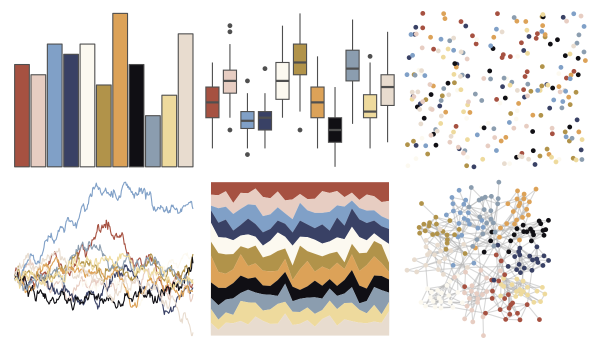
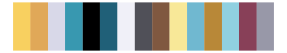

# dutchmasters - pearl_earring 

::: columns
::: {.column width="50%"}

**Github**

[EdwinTh/dutchmasters](https://github.com/EdwinTh/dutchmasters)
:::

::: {.column width="50%"}

**CRAN**

Not on CRAN
:::
:::

<hr> 

Use with [paletteer](https://emilhvitfeldt.github.io/paletteer/) package:

```r
library(paletteer)
paletteer_d("dutchmasters::pearl_earring")
```

Use raw:

```r
c("#A65141FF", "#E7CDC2FF", "#80A0C7FF", "#394165FF", "#FCF9F0FF", "#B1934AFF", "#DCA258FF", "#100F14FF", "#8B9DAFFF", "#EEDA9DFF", "#E8DCCFFF")
``` 

 

<br>

# Related Palettes

<div class="list" style="display: grid; grid-template-columns: auto auto auto;"> <figure class="figure">
<a href="../../awtools/a_palette/"> </a>
</figure> <figure class="figure">
<a href="../../palettetown/feebas/"> </a>
</figure> <figure class="figure">
<a href="../../palettetown/hariyama/"> </a>
</figure> <figure class="figure">
<a href="../../palettetown/camerupt/"> </a>
</figure> <figure class="figure">
<a href="../../palettetown/linoone/"> </a>
</figure> <figure class="figure">
<a href="../../palettetown/ninjask/"> </a>
</figure> <figure class="figure">
<a href="../../palettetown/poochyena/"> </a>
</figure> <figure class="figure">
<a href="../../palettetown/pelipper/"> </a>
</figure> <figure class="figure">
<a href="../../palettetown/minun/"> </a>
</figure> <figure class="figure">
<a href="../../palettetown/anorith/"> </a>
</figure> <figure class="figure">
<a href="../../palettetown/spheal/"> </a>
</figure> <figure class="figure">
<a href="../../palettetown/dodrio/"> </a>
</figure> 
</div>
