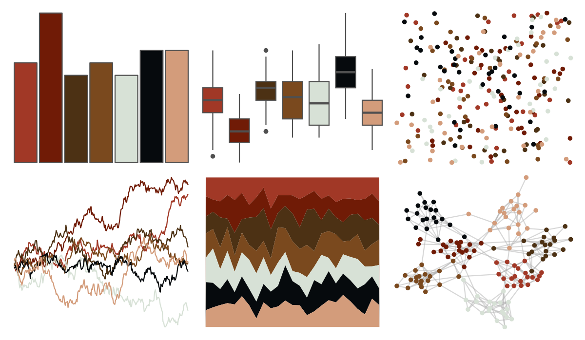
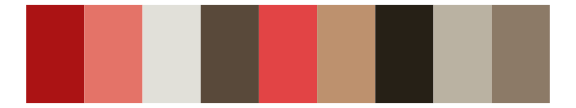

# dutchmasters - staalmeesters 

::: columns
::: {.column width="50%"}

**Github**

[EdwinTh/dutchmasters](https://github.com/EdwinTh/dutchmasters)
:::

::: {.column width="50%"}

**CRAN**

Not on CRAN
:::
:::

<hr> 

Use with [paletteer](https://emilhvitfeldt.github.io/paletteer/) package:

```r
library(paletteer)
paletteer_d("dutchmasters::staalmeesters")
```

Use raw:

```r
c("#A13826FF", "#701B06FF", "#4C3114FF", "#7A491EFF", "#D7E1D6FF", "#060A0DFF", "#D39C7BFF")
``` 

 

<br>

# Related Palettes

<div class="list" style="display: grid; grid-template-columns: auto auto auto;"> <figure class="figure">
<a href="../../awtools/a_palette/"> </a>
</figure> <figure class="figure">
<a href="../../peRReo/don/"> </a>
</figure> <figure class="figure">
<a href="../../feathers/superb_fairy_wren/"> </a>
</figure> <figure class="figure">
<a href="../../nationalparkcolors/Hawaii/"> </a>
</figure> <figure class="figure">
<a href="../../peRReo/daddy1/"> </a>
</figure> <figure class="figure">
<a href="../../feathers/spotted_pardalote/"> </a>
</figure> <figure class="figure">
<a href="../../palettetown/torkoal/"> </a>
</figure> <figure class="figure">
<a href="../../colRoz/p_cincta/"> </a>
</figure> <figure class="figure">
<a href="../../peRReo/beckyg/"> </a>
</figure> <figure class="figure">
<a href="../../tayloRswift/taylorRed/"> </a>
</figure> <figure class="figure">
<a href="../../DresdenColor/bloodrites/"> </a>
</figure> <figure class="figure">
<a href="../../peRReo/badbunny2/"> </a>
</figure> 
</div>
