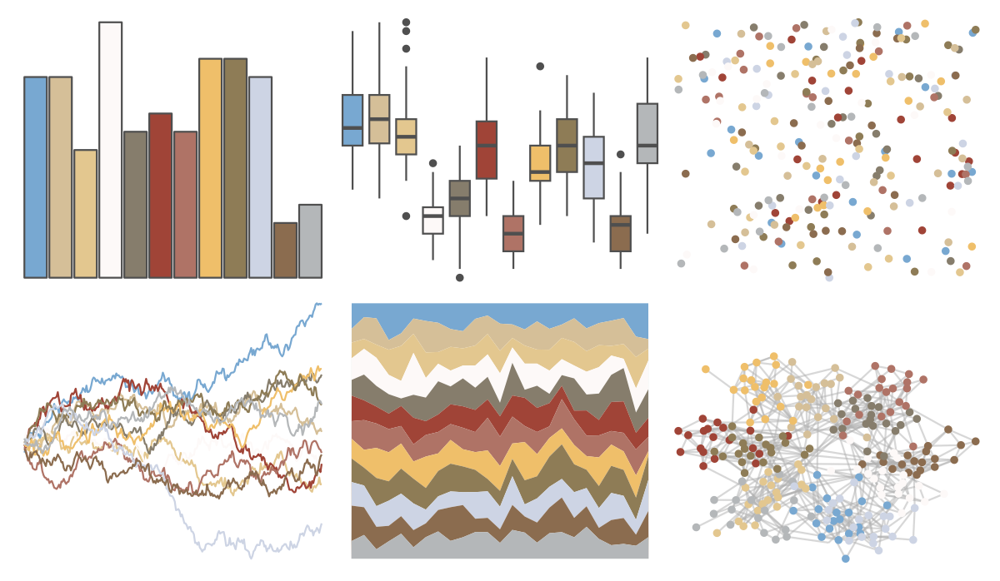

# dutchmasters - view_of_Delft 

::: columns
::: {.column width="50%"}

**Github**

[EdwinTh/dutchmasters](https://github.com/EdwinTh/dutchmasters)
:::

::: {.column width="50%"}

**CRAN**

Not on CRAN
:::
:::

<hr> 

Use with [paletteer](https://emilhvitfeldt.github.io/paletteer/) package:

```r
library(paletteer)
paletteer_d("dutchmasters::view_of_Delft")
```

Use raw:

```r
c("#78A8D1FF", "#D5BF98FF", "#E3C78FFF", "#FDF9F8FF", "#867D6CFF", "#A04437FF", "#AF7366FF", "#EFBF6AFF", "#8E7C56FF", "#CDD4E4FF", "#8B6C4FFF", "#B4B7B9FF")
``` 

 

<br>

# Related Palettes

<div class="list" style="display: grid; grid-template-columns: auto auto auto;"> <figure class="figure">
<a href="../../amerika/Dem_Ind_Rep3/"> </a>
</figure> <figure class="figure">
<a href="../../palettetown/rhydon/"> </a>
</figure> <figure class="figure">
<a href="../../palettetown/claydol/"> </a>
</figure> <figure class="figure">
<a href="../../IslamicArt/abu_dhabi/"> </a>
</figure> <figure class="figure">
<a href="../../Redmonder/qMSOMed/"> </a>
</figure> <figure class="figure">
<a href="../../ggthemes/Winter/"> </a>
</figure> <figure class="figure">
<a href="../../palettetown/hypno/"> </a>
</figure> <figure class="figure">
<a href="../../palettetown/kabutops/"> </a>
</figure> <figure class="figure">
<a href="../../palettetown/skarmory/"> </a>
</figure> <figure class="figure">
<a href="../../Redmonder/qMSOOr/"> </a>
</figure> <figure class="figure">
<a href="../../palettetown/snorlax/"> </a>
</figure> <figure class="figure">
<a href="../../yarrr/decision/"> </a>
</figure> 
</div>
