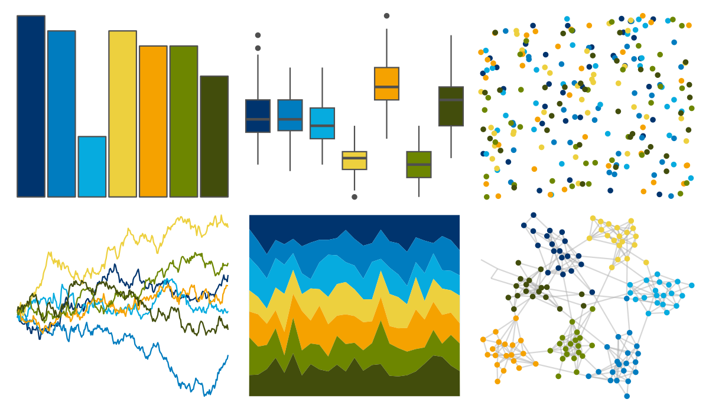

# feathers - bee_eater 

::: columns
::: {.column width="50%"}

**Github**

[shandiya/feathers](https://github.com/shandiya/feathers)
:::

::: {.column width="50%"}

**CRAN**

Not on CRAN
:::
:::

<hr> 

Use with [paletteer](https://emilhvitfeldt.github.io/paletteer/) package:

```r
library(paletteer)
paletteer_d("feathers::bee_eater")
```

Use raw:

```r
c("#00346EFF", "#007CBFFF", "#06ABDFFF", "#EDD03EFF", "#F5A200FF", "#6D8600FF", "#424D0CFF")
``` 

 

<br>

# Related Palettes

<div class="list" style="display: grid; grid-template-columns: auto auto auto;"> <figure class="figure">
<a href="../../awtools/a_palette/"> </a>
</figure> <figure class="figure">
<a href="../../ButterflyColors/hamadryas_feronia/"> </a>
</figure> <figure class="figure">
<a href="../../ButterflyColors/hamadryas_feronia/"> </a>
</figure> <figure class="figure">
<a href="../../LaCroixColoR/Lemon/"> </a>
</figure> <figure class="figure">
<a href="../../fishualize/Holacanthus_ciliaris/"> </a>
</figure> <figure class="figure">
<a href="../../fishualize/Pomacanthus_paru/"> </a>
</figure> <figure class="figure">
<a href="../../fishualize/Thalassoma_pavo/"> </a>
</figure> <figure class="figure">
<a href="../../fishualize/Acanthurus_coeruleus/"> </a>
</figure> <figure class="figure">
<a href="../../fishualize/Rhinecanthus_aculeatus/"> </a>
</figure> <figure class="figure">
<a href="../../MetBrewer/Lakota/"> </a>
</figure> <figure class="figure">
<a href="../../LaCroixColoR/Orange/"> </a>
</figure> <figure class="figure">
<a href="../../fishualize/Halichoeres_garnoti/"> </a>
</figure> 
</div>
