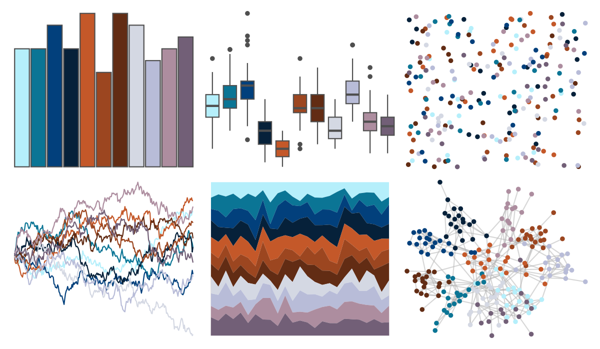

# feathers - blue_winged_kookaburra 

::: columns
::: {.column width="50%"}

**Github**

[shandiya/feathers](https://github.com/shandiya/feathers)
:::

::: {.column width="50%"}

**CRAN**

Not on CRAN
:::
:::

<hr> 

Use with [paletteer](https://emilhvitfeldt.github.io/paletteer/) package:

```r
library(paletteer)
paletteer_d("feathers::blue_winged_kookaburra")
```

Use raw:

```r
c("#B5EFFBFF", "#0B7595FF", "#02407CFF", "#06213AFF", "#C45829FF", "#9C4620FF", "#622C14FF", "#D4D8E3FF", "#B8BCD8FF", "#AD8D9FFF", "#725F77FF")
``` 

 

<br>

# Related Palettes

<div class="list" style="display: grid; grid-template-columns: auto auto auto;"> <figure class="figure">
<a href="../../amerika/Dem_Ind_Rep3/"> </a>
</figure> <figure class="figure">
<a href="../../werpals/uyuni/"> </a>
</figure> <figure class="figure">
<a href="../../RColorBrewer/RdBu/"> </a>
</figure> <figure class="figure">
<a href="../../peRReo/karolg/"> </a>
</figure> <figure class="figure">
<a href="../../PrettyCols/RedBlues/"> </a>
</figure> <figure class="figure">
<a href="../../palettetown/azurill/"> </a>
</figure> <figure class="figure">
<a href="../../palettetown/marill/"> </a>
</figure> <figure class="figure">
<a href="../../palettetown/nidoranf/"> </a>
</figure> <figure class="figure">
<a href="../../palettetown/nidorina/"> </a>
</figure> <figure class="figure">
<a href="../../palettetown/phanpy/"> </a>
</figure> <figure class="figure">
<a href="../../palettetown/meditite/"> </a>
</figure> <figure class="figure">
<a href="../../palettetown/tangela/"> </a>
</figure> 
</div>
