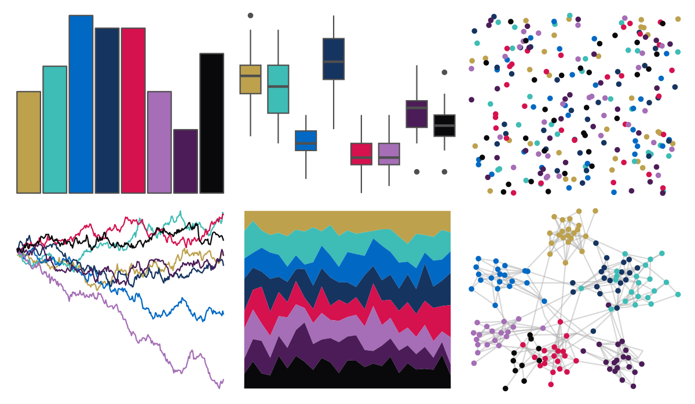

# feathers - cassowary 

::: columns
::: {.column width="50%"}

**Github**

[shandiya/feathers](https://github.com/shandiya/feathers)
:::

::: {.column width="50%"}

**CRAN**

Not on CRAN
:::
:::

<hr> 

Use with [paletteer](https://emilhvitfeldt.github.io/paletteer/) package:

```r
library(paletteer)
paletteer_d("feathers::cassowary")
```

Use raw:

```r
c("#BDA14DFF", "#3EBCB6FF", "#0169C4FF", "#153460FF", "#D5114EFF", "#A56EB6FF", "#4B1C57FF", "#09090CFF")
``` 

 

<br>

# Related Palettes

<div class="list" style="display: grid; grid-template-columns: auto auto auto;"> <figure class="figure">
<a href="../../awtools/a_palette/"> </a>
</figure> <figure class="figure">
<a href="../../ButterflyColors/hamadryas_feronia/"> </a>
</figure> <figure class="figure">
<a href="../../ButterflyColors/hamadryas_feronia/"> </a>
</figure> <figure class="figure">
<a href="../../peRReo/planb/"> </a>
</figure> <figure class="figure">
<a href="../../tvthemes/Dark/"> </a>
</figure> <figure class="figure">
<a href="../../ggsci/lanonc_lancet/"> </a>
</figure> <figure class="figure">
<a href="../../tvthemes/CrystalGems/"> </a>
</figure> <figure class="figure">
<a href="../../tvthemes/attackOnTitan/"> </a>
</figure> <figure class="figure">
<a href="../../tvthemes/Garnet/"> </a>
</figure> <figure class="figure">
<a href="../../ggsci/default_aaas/"> </a>
</figure> <figure class="figure">
<a href="../../rcartocolor/Safe/"> </a>
</figure> <figure class="figure">
<a href="../../nbapalettes/suns/"> </a>
</figure> 
</div>
