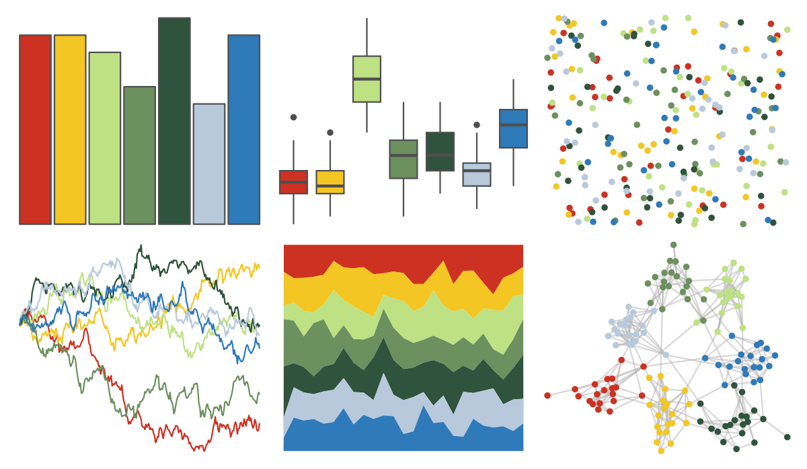

# feathers - eastern_rosella 

::: columns
::: {.column width="50%"}

**Github**

[shandiya/feathers](https://github.com/shandiya/feathers)
:::

::: {.column width="50%"}

**CRAN**

Not on CRAN
:::
:::

<hr> 

Use with [paletteer](https://emilhvitfeldt.github.io/paletteer/) package:

```r
library(paletteer)
paletteer_d("feathers::eastern_rosella")
```

Use raw:

```r
c("#CD3122FF", "#F4C623FF", "#BEE183FF", "#6C905EFF", "#2F533CFF", "#B8C9DCFF", "#2F7AB9FF")
``` 

 

<br>

# Related Palettes

<div class="list" style="display: grid; grid-template-columns: auto auto auto;"> <figure class="figure">
<a href="../../awtools/a_palette/"> </a>
</figure> <figure class="figure">
<a href="../../jcolors/pal9/"> </a>
</figure> <figure class="figure">
<a href="../../fishualize/Koumansetta_rainfordi/"> </a>
</figure> <figure class="figure">
<a href="../../werpals/pan/"> </a>
</figure> <figure class="figure">
<a href="../../LaCroixColoR/CeriseLimon/"> </a>
</figure> <figure class="figure">
<a href="../../lisa/PabloPicasso_1/"> </a>
</figure> <figure class="figure">
<a href="../../rtist/picasso/"> </a>
</figure> <figure class="figure">
<a href="../../lisa/ClaesOldenburg/"> </a>
</figure> <figure class="figure">
<a href="../../rtist/oldenburg/"> </a>
</figure> <figure class="figure">
<a href="../../futurevisions/earth/"> </a>
</figure> <figure class="figure">
<a href="../../fishualize/Etheostoma_spectabile/"> </a>
</figure> <figure class="figure">
<a href="../../rcartocolor/Temps/"> </a>
</figure> 
</div>
