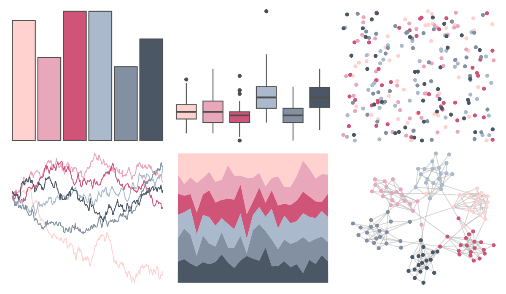

# feathers - galah 

::: columns
::: {.column width="50%"}

**Github**

[shandiya/feathers](https://github.com/shandiya/feathers)
:::

::: {.column width="50%"}

**CRAN**

Not on CRAN
:::
:::

<hr> 

Use with [paletteer](https://emilhvitfeldt.github.io/paletteer/) package:

```r
library(paletteer)
paletteer_d("feathers::galah")
```

Use raw:

```r
c("#FFD2CFFF", "#E9A7BBFF", "#D05478FF", "#AAB9CCFF", "#8390A2FF", "#4C5766FF")
``` 

 

<br>

# Related Palettes

<div class="list" style="display: grid; grid-template-columns: auto auto auto;"> <figure class="figure">
<a href="../../awtools/a_palette/"> </a>
</figure> <figure class="figure">
<a href="../../beyonce/X49/"> </a>
</figure> <figure class="figure">
<a href="../../beyonce/X90/"> </a>
</figure> <figure class="figure">
<a href="../../nbapalettes/sixers_city/"> </a>
</figure> <figure class="figure">
<a href="../../MetBrewer/Cassatt1/"> </a>
</figure> <figure class="figure">
<a href="../../palettetown/beldum/"> </a>
</figure> <figure class="figure">
<a href="../../MapPalettes/tealberry_pie/"> </a>
</figure> <figure class="figure">
<a href="../../ggthemes/Classic_Purple_Gray_12/"> </a>
</figure> <figure class="figure">
<a href="../../ggthemes/Classic_Purple_Gray_6/"> </a>
</figure> <figure class="figure">
<a href="../../palettetown/lugia/"> </a>
</figure> <figure class="figure">
<a href="../../ggthemes/Purple_Pink_Gray/"> </a>
</figure> <figure class="figure">
<a href="../../beyonce/X51/"> </a>
</figure> 
</div>
