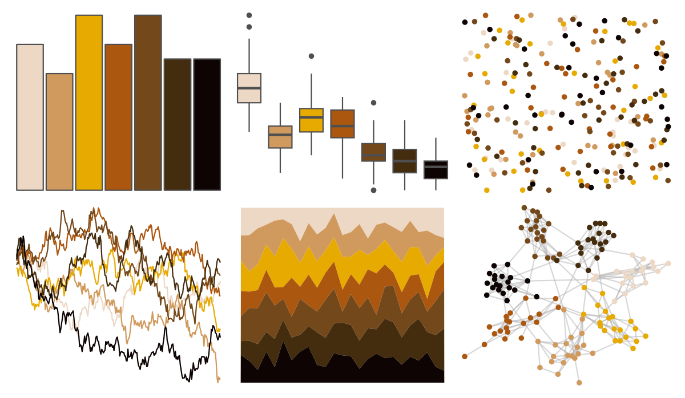

# feathers - plains_wanderer 

::: columns
::: {.column width="50%"}

**Github**

[shandiya/feathers](https://github.com/shandiya/feathers)
:::

::: {.column width="50%"}

**CRAN**

Not on CRAN
:::
:::

<hr> 

Use with [paletteer](https://emilhvitfeldt.github.io/paletteer/) package:

```r
library(paletteer)
paletteer_d("feathers::plains_wanderer")
```

Use raw:

```r
c("#EDD8C5FF", "#D09A5EFF", "#E7AA01FF", "#AC570FFF", "#73481BFF", "#442C0EFF", "#0D0403FF")
``` 

 

<br>

# Related Palettes

<div class="list" style="display: grid; grid-template-columns: auto auto auto;"> <figure class="figure">
<a href="../../awtools/a_palette/"> </a>
</figure> <figure class="figure">
<a href="../../nbapalettes/celtics2/"> </a>
</figure> <figure class="figure">
<a href="../../tvthemes/Lannister/"> </a>
</figure> <figure class="figure">
<a href="../../DresdenColor/smallfavor/"> </a>
</figure> <figure class="figure">
<a href="../../DresdenColor/changes/"> </a>
</figure> <figure class="figure">
<a href="../../dutchmasters/staalmeesters/"> </a>
</figure> <figure class="figure">
<a href="../../palettetown/zigzagoon/"> </a>
</figure> <figure class="figure">
<a href="../../lisa/Rembrandt/"> </a>
</figure> <figure class="figure">
<a href="../../feathers/superb_fairy_wren/"> </a>
</figure> <figure class="figure">
<a href="../../Manu/Kea/"> </a>
</figure> <figure class="figure">
<a href="../../tvthemes/Stannis/"> </a>
</figure> <figure class="figure">
<a href="../../palettetown/sentret/"> </a>
</figure> 
</div>
