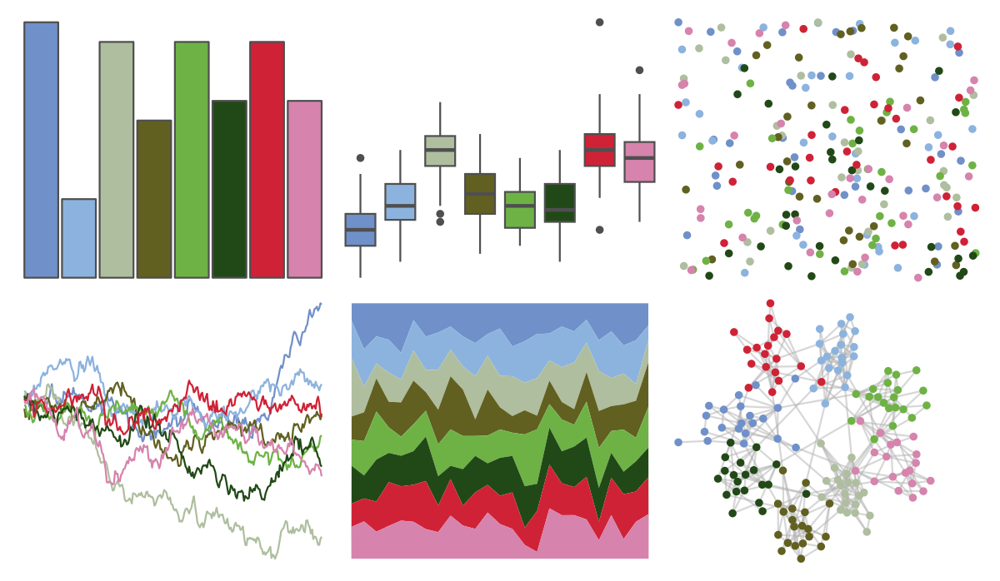

# feathers - princess_parrot 

::: columns
::: {.column width="50%"}

**Github**

[shandiya/feathers](https://github.com/shandiya/feathers)
:::

::: {.column width="50%"}

**CRAN**

Not on CRAN
:::
:::

<hr> 

Use with [paletteer](https://emilhvitfeldt.github.io/paletteer/) package:

```r
library(paletteer)
paletteer_d("feathers::princess_parrot")
```

Use raw:

```r
c("#7090C9FF", "#8CB3DEFF", "#AFBE9FFF", "#616020FF", "#6EB245FF", "#214917FF", "#CF2236FF", "#D683ADFF")
``` 

 

<br>

# Related Palettes

<div class="list" style="display: grid; grid-template-columns: auto auto auto;"> <figure class="figure">
<a href="../../amerika/Dem_Ind_Rep3/"> </a>
</figure> <figure class="figure">
<a href="../../MoMAColors/Kippenberger/"> </a>
</figure> <figure class="figure">
<a href="../../khroma/bright/"> </a>
</figure> <figure class="figure">
<a href="../../ggthemr/grass/"> </a>
</figure> <figure class="figure">
<a href="../../feathers/eastern_rosella/"> </a>
</figure> <figure class="figure">
<a href="../../ggsci/signature_substitutions_cosmic/"> </a>
</figure> <figure class="figure">
<a href="../../peRReo/buenavista/"> </a>
</figure> <figure class="figure">
<a href="../../lisa/JoanMiro/"> </a>
</figure> <figure class="figure">
<a href="../../peRReo/shakira/"> </a>
</figure> <figure class="figure">
<a href="../../calecopal/coastaldune2/"> </a>
</figure> <figure class="figure">
<a href="../../MoMAColors/Rattner/"> </a>
</figure> <figure class="figure">
<a href="../../lisa/JamesJean/"> </a>
</figure> 
</div>
