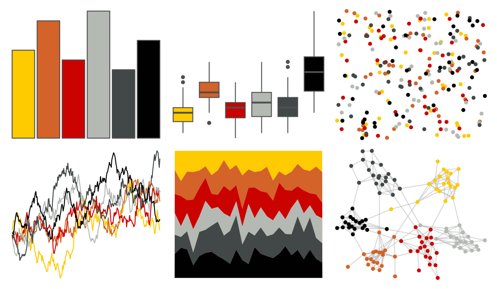

# feathers - spotted_pardalote 

::: columns
::: {.column width="50%"}

**Github**

[shandiya/feathers](https://github.com/shandiya/feathers)
:::

::: {.column width="50%"}

**CRAN**

Not on CRAN
:::
:::

<hr> 

Use with [paletteer](https://emilhvitfeldt.github.io/paletteer/) package:

```r
library(paletteer)
paletteer_d("feathers::spotted_pardalote")
```

Use raw:

```r
c("#FECA00FF", "#D36328FF", "#CB0300FF", "#B4B9B3FF", "#424847FF", "#000100FF")
``` 

 

<br>

# Related Palettes

<div class="list" style="display: grid; grid-template-columns: auto auto auto;"> <figure class="figure">
<a href="../../awtools/a_palette/"> </a>
</figure> <figure class="figure">
<a href="../../fishualize/Salvelinus_fontinalis/"> </a>
</figure> <figure class="figure">
<a href="../../DresdenColor/smallfavor/"> </a>
</figure> <figure class="figure">
<a href="../../DresdenColor/stormfront/"> </a>
</figure> <figure class="figure">
<a href="../../nationalparkcolors/Saguaro/"> </a>
</figure> <figure class="figure">
<a href="../../feathers/superb_fairy_wren/"> </a>
</figure> <figure class="figure">
<a href="../../lisa/HilmaafKlint/"> </a>
</figure> <figure class="figure">
<a href="../../fishualize/Pterois_volitans/"> </a>
</figure> <figure class="figure">
<a href="../../DresdenColor/changes/"> </a>
</figure> <figure class="figure">
<a href="../../futurevisions/mars/"> </a>
</figure> <figure class="figure">
<a href="../../werpals/small_world/"> </a>
</figure> <figure class="figure">
<a href="../../dutchmasters/staalmeesters/"> </a>
</figure> 
</div>
