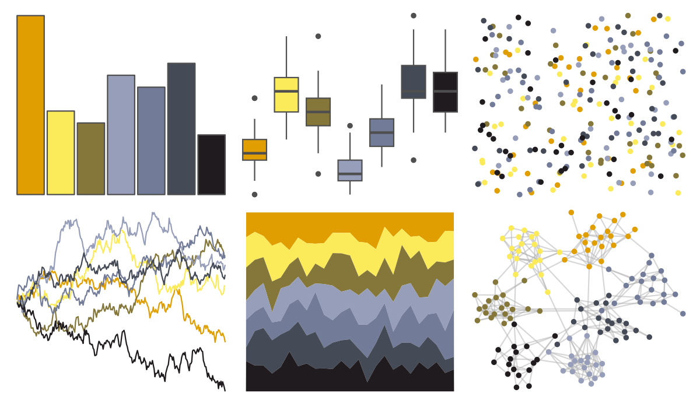

# feathers - yellow_robin 

::: columns
::: {.column width="50%"}

**Github**

[shandiya/feathers](https://github.com/shandiya/feathers)
:::

::: {.column width="50%"}

**CRAN**

Not on CRAN
:::
:::

<hr> 

Use with [paletteer](https://emilhvitfeldt.github.io/paletteer/) package:

```r
library(paletteer)
paletteer_d("feathers::yellow_robin")
```

Use raw:

```r
c("#E19E00FF", "#FBEB5BFF", "#85773AFF", "#979EB9FF", "#727B98FF", "#454B56FF", "#201B1EFF")
``` 

 

<br>

# Related Palettes

<div class="list" style="display: grid; grid-template-columns: auto auto auto;"> <figure class="figure">
<a href="../../awtools/a_palette/"> </a>
</figure> <figure class="figure">
<a href="../../ButterflyColors/hamadryas_feronia/"> </a>
</figure> <figure class="figure">
<a href="../../ButterflyColors/hamadryas_feronia/"> </a>
</figure> <figure class="figure">
<a href="../../PrettyCols/Autumn/"> </a>
</figure> <figure class="figure">
<a href="../../palettetown/shelgon/"> </a>
</figure> <figure class="figure">
<a href="../../palettetown/jirachi/"> </a>
</figure> <figure class="figure">
<a href="../../peRReo/buenavista/"> </a>
</figure> <figure class="figure">
<a href="../../peRReo/calle13/"> </a>
</figure> <figure class="figure">
<a href="../../fishualize/Chaetodon_pelewensis/"> </a>
</figure> <figure class="figure">
<a href="../../nationalparkcolors/GeneralGrant/"> </a>
</figure> <figure class="figure">
<a href="../../ggthemr/light/"> </a>
</figure> <figure class="figure">
<a href="../../colRoz/virgo/"> </a>
</figure> 
</div>
