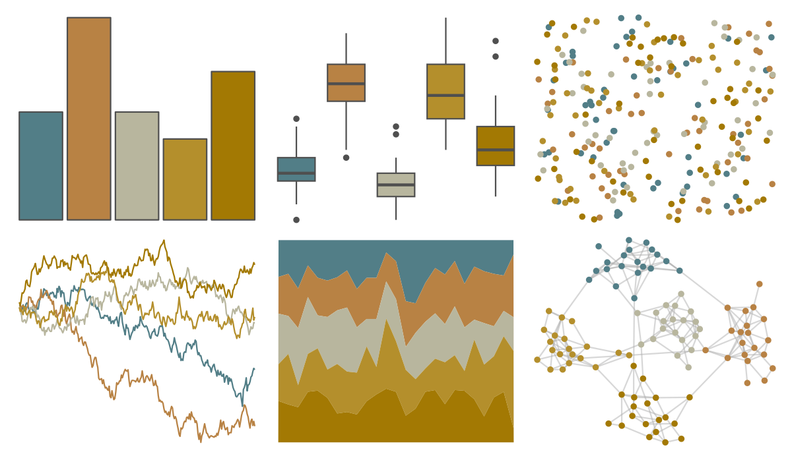

# fishualize - Acanthisthius_brasilianus 

::: columns
::: {.column width="50%"}

**Github**

[nschiett/fishualize](https://github.com/nschiett/fishualize)
:::

::: {.column width="50%"}

**CRAN**

[fishualize](https://CRAN.R-project.org/package=fishualize)
:::
:::

<hr> 

Use with [paletteer](https://emilhvitfeldt.github.io/paletteer/) package:

```r
library(paletteer)
paletteer_d("fishualize::Acanthisthius_brasilianus")
```

Use raw:

```r
c("#527E87FF", "#B88244FF", "#B8B69EFF", "#B48F2CFF", "#A37903FF")
``` 

 

<br>

# Related Palettes

<div class="list" style="display: grid; grid-template-columns: auto auto auto;"> <figure class="figure">
<a href="../../amerika/Dem_Ind_Rep3/"> </a>
</figure> <figure class="figure">
<a href="../../lisa/PaulCezanne/"> </a>
</figure> <figure class="figure">
<a href="../../IslamicArt/cordoba/"> </a>
</figure> <figure class="figure">
<a href="../../ggthemes/excel_Mesh/"> </a>
</figure> <figure class="figure">
<a href="../../calecopal/chaparral1/"> </a>
</figure> <figure class="figure">
<a href="../../NatParksPalettes/SouthDowns/"> </a>
</figure> <figure class="figure">
<a href="../../IslamicArt/istanbul3/"> </a>
</figure> <figure class="figure">
<a href="../../ggthemes/excel_Parcel/"> </a>
</figure> <figure class="figure">
<a href="../../lisa/WassilyKandinsky/"> </a>
</figure> <figure class="figure">
<a href="../../calecopal/dudleya/"> </a>
</figure> <figure class="figure">
<a href="../../fishualize/Barbus_barbus/"> </a>
</figure> <figure class="figure">
<a href="../../fishualize/Cetengraulis_edentulus/"> </a>
</figure> 
</div>
