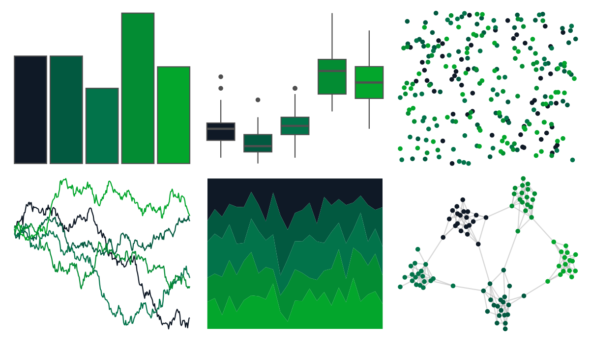

# fishualize - Acanthostracion_polygonius 

::: columns
::: {.column width="50%"}

**Github**

[nschiett/fishualize](https://github.com/nschiett/fishualize)
:::

::: {.column width="50%"}

**CRAN**

[fishualize](https://CRAN.R-project.org/package=fishualize)
:::
:::

<hr> 

Use with [paletteer](https://emilhvitfeldt.github.io/paletteer/) package:

```r
library(paletteer)
paletteer_d("fishualize::Acanthostracion_polygonius")
```

Use raw:

```r
c("#0F1926FF", "#025940FF", "#02734AFF", "#038C33FF", "#03A62CFF")
``` 

 

<br>

# Related Palettes

<div class="list" style="display: grid; grid-template-columns: auto auto auto;"> <figure class="figure">
<a href="../../awtools/a_palette/"> </a>
</figure> <figure class="figure">
<a href="../../calecopal/kelp2/"> </a>
</figure> <figure class="figure">
<a href="../../NatParksPalettes/Everglades/"> </a>
</figure> <figure class="figure">
<a href="../../fishualize/Elagatis_bipinnulata/"> </a>
</figure> <figure class="figure">
<a href="../../colRoz/daintree/"> </a>
</figure> <figure class="figure">
<a href="../../nbapalettes/mavericks_city/"> </a>
</figure> <figure class="figure">
<a href="../../MapPalettes/green_machine/"> </a>
</figure> <figure class="figure">
<a href="../../ghibli/MarnieMedium2/"> </a>
</figure> <figure class="figure">
<a href="../../ggthemes/wsj_black_green/"> </a>
</figure> <figure class="figure">
<a href="../../ggprism/evergreen/"> </a>
</figure> <figure class="figure">
<a href="../../trekcolors/romulan/"> </a>
</figure> <figure class="figure">
<a href="../../LaCroixColoR/Lime/"> </a>
</figure> 
</div>
