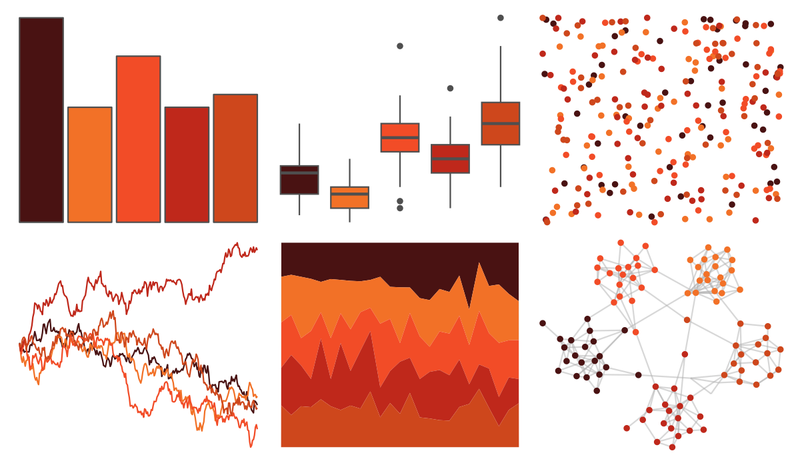

# fishualize - Acanthostracion_polygonius_y 

::: columns
::: {.column width="50%"}

**Github**

[nschiett/fishualize](https://github.com/nschiett/fishualize)
:::

::: {.column width="50%"}

**CRAN**

[fishualize](https://CRAN.R-project.org/package=fishualize)
:::
:::

<hr> 

Use with [paletteer](https://emilhvitfeldt.github.io/paletteer/) package:

```r
library(paletteer)
paletteer_d("fishualize::Acanthostracion_polygonius_y")
```

Use raw:

```r
c("#491212FF", "#F27127FF", "#F24C27FF", "#BF281BFF", "#CE471CFF")
``` 

 

<br>

# Related Palettes

<div class="list" style="display: grid; grid-template-columns: auto auto auto;"> <figure class="figure">
<a href="../../awtools/a_palette/"> </a>
</figure> <figure class="figure">
<a href="../../ButterflyColors/hamadryas_feronia/"> </a>
</figure> <figure class="figure">
<a href="../../ButterflyColors/hamadryas_feronia/"> </a>
</figure> <figure class="figure">
<a href="../../fishualize/Heretopriacanthus_cruentatus/"> </a>
</figure> <figure class="figure">
<a href="../../ButterflyColors/marpesia_petreus/"> </a>
</figure> <figure class="figure">
<a href="../../miscpalettes/chocolate/"> </a>
</figure> <figure class="figure">
<a href="../../rockthemes/alice/"> </a>
</figure> <figure class="figure">
<a href="../../beyonce/X20/"> </a>
</figure> <figure class="figure">
<a href="../../fishualize/Pleuronectes_platessa/"> </a>
</figure> <figure class="figure">
<a href="../../MetBrewer/Peru2/"> </a>
</figure> <figure class="figure">
<a href="../../fishualize/Sargocentron_bullisi/"> </a>
</figure> <figure class="figure">
<a href="../../lisa/TerryFrost/"> </a>
</figure> 
</div>
