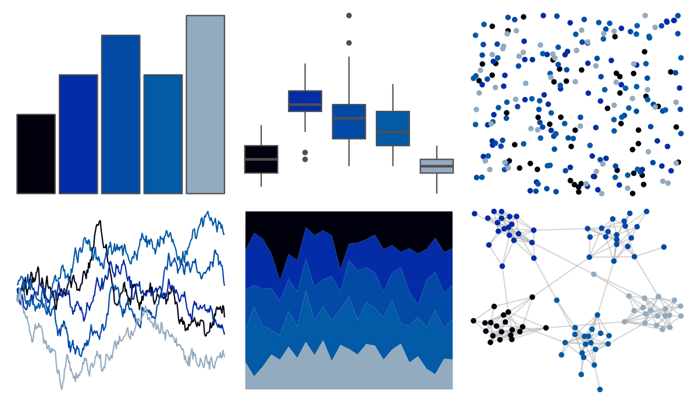

# fishualize - Acanthurus_chirurgus 

::: columns
::: {.column width="50%"}

**Github**

[nschiett/fishualize](https://github.com/nschiett/fishualize)
:::

::: {.column width="50%"}

**CRAN**

[fishualize](https://CRAN.R-project.org/package=fishualize)
:::
:::

<hr> 

Use with [paletteer](https://emilhvitfeldt.github.io/paletteer/) package:

```r
library(paletteer)
paletteer_d("fishualize::Acanthurus_chirurgus")
```

Use raw:

```r
c("#00010DFF", "#032CA6FF", "#034AA6FF", "#035AA6FF", "#93ABBFFF")
``` 

 

<br>

# Related Palettes

<div class="list" style="display: grid; grid-template-columns: auto auto auto;"> <figure class="figure">
<a href="../../awtools/a_palette/"> </a>
</figure> <figure class="figure">
<a href="../../ButterflyColors/hamadryas_feronia/"> </a>
</figure> <figure class="figure">
<a href="../../ButterflyColors/hamadryas_feronia/"> </a>
</figure> <figure class="figure">
<a href="../../beyonce/X15/"> </a>
</figure> <figure class="figure">
<a href="../../ggprism/office/"> </a>
</figure> <figure class="figure">
<a href="../../beyonce/X13/"> </a>
</figure> <figure class="figure">
<a href="../../yarrr/eternal/"> </a>
</figure> <figure class="figure">
<a href="../../colRoz/physalia/"> </a>
</figure> <figure class="figure">
<a href="../../palettesForR/Cool/"> </a>
</figure> <figure class="figure">
<a href="../../beyonce/X37/"> </a>
</figure> <figure class="figure">
<a href="../../beyonce/X31/"> </a>
</figure> <figure class="figure">
<a href="../../calecopal/sbchannel/"> </a>
</figure> 
</div>
