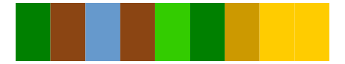

# fishualize - Acanthurus_coeruleus 

::: columns
::: {.column width="50%"}

**Github**

[nschiett/fishualize](https://github.com/nschiett/fishualize)
:::

::: {.column width="50%"}

**CRAN**

[fishualize](https://CRAN.R-project.org/package=fishualize)
:::
:::

<hr> 

Use with [paletteer](https://emilhvitfeldt.github.io/paletteer/) package:

```r
library(paletteer)
paletteer_d("fishualize::Acanthurus_coeruleus")
```

Use raw:

```r
c("#0476D9FF", "#01260EFF", "#618C03FF", "#BFB304FF", "#A68B03FF")
``` 

 

<br>

# Related Palettes

<div class="list" style="display: grid; grid-template-columns: auto auto auto;"> <figure class="figure">
<a href="../../awtools/a_palette/"> </a>
</figure> <figure class="figure">
<a href="../../feathers/bee_eater/"> </a>
</figure> <figure class="figure">
<a href="../../NatParksPalettes/Everglades/"> </a>
</figure> <figure class="figure">
<a href="../../fishualize/Thalassoma_pavo/"> </a>
</figure> <figure class="figure">
<a href="../../ggprism/sunny_garden3/"> </a>
</figure> <figure class="figure">
<a href="../../fishualize/Coryphaena_hippurus/"> </a>
</figure> <figure class="figure">
<a href="../../ggprism/sunny_garden/"> </a>
</figure> <figure class="figure">
<a href="../../fishualize/Pomacanthus_paru/"> </a>
</figure> <figure class="figure">
<a href="../../fishualize/Holacanthus_ciliaris/"> </a>
</figure> <figure class="figure">
<a href="../../fishualize/Antennarius_multiocellatus/"> </a>
</figure> <figure class="figure">
<a href="../../fishualize/Halichoeres_garnoti/"> </a>
</figure> <figure class="figure">
<a href="../../LaCroixColoR/Lemon/"> </a>
</figure> 
</div>
