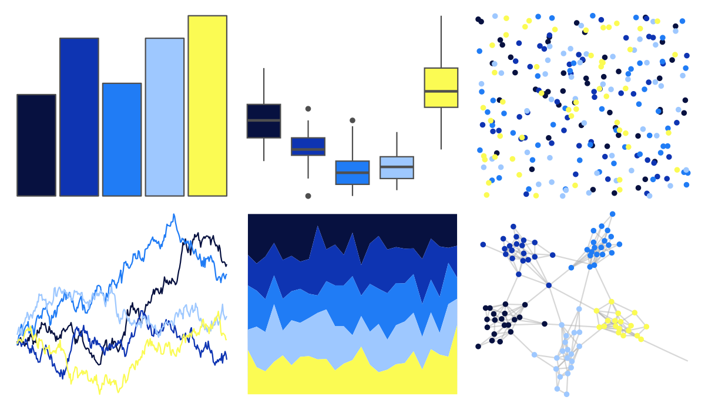

# fishualize - Acanthurus_leucosternon 

::: columns
::: {.column width="50%"}

**Github**

[nschiett/fishualize](https://github.com/nschiett/fishualize)
:::

::: {.column width="50%"}

**CRAN**

[fishualize](https://CRAN.R-project.org/package=fishualize)
:::
:::

<hr> 

Use with [paletteer](https://emilhvitfeldt.github.io/paletteer/) package:

```r
library(paletteer)
paletteer_d("fishualize::Acanthurus_leucosternon")
```

Use raw:

```r
c("#071140FF", "#0E34B2FF", "#207CF5FF", "#9EC8FFFF", "#FBFB53FF")
``` 

 

<br>

# Related Palettes

<div class="list" style="display: grid; grid-template-columns: auto auto auto;"> <figure class="figure">
<a href="../../amerika/Dem_Ind_Rep3/"> </a>
</figure> <figure class="figure">
<a href="../../fishualize/Pomacanthus_imperator/"> </a>
</figure> <figure class="figure">
<a href="../../fishualize/Thalassoma_bifasciatum/"> </a>
</figure> <figure class="figure">
<a href="../../ggprism/viridis/"> </a>
</figure> <figure class="figure">
<a href="../../lisa/YvesKlein/"> </a>
</figure> <figure class="figure">
<a href="../../nbapalettes/hornets_believe/"> </a>
</figure> <figure class="figure">
<a href="../../fishualize/Paracanthurus_hepatus/"> </a>
</figure> <figure class="figure">
<a href="../../fishualize/Chromis_vanderbilti/"> </a>
</figure> <figure class="figure">
<a href="../../fishualize/Acanthurus_olivaceus/"> </a>
</figure> <figure class="figure">
<a href="../../RColorBrewer/YlGnBu/"> </a>
</figure> <figure class="figure">
<a href="../../beyonce/X18/"> </a>
</figure> <figure class="figure">
<a href="../../fishualize/Zebrasoma_xanthurum/"> </a>
</figure> 
</div>
