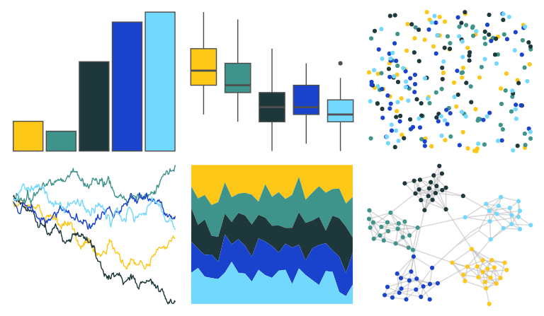

# fishualize - Acanthurus_olivaceus 

::: columns
::: {.column width="50%"}

**Github**

[nschiett/fishualize](https://github.com/nschiett/fishualize)
:::

::: {.column width="50%"}

**CRAN**

[fishualize](https://CRAN.R-project.org/package=fishualize)
:::
:::

<hr> 

Use with [paletteer](https://emilhvitfeldt.github.io/paletteer/) package:

```r
library(paletteer)
paletteer_d("fishualize::Acanthurus_olivaceus")
```

Use raw:

```r
c("#FDC718FF", "#3E938BFF", "#1D373AFF", "#1942CDFF", "#73D8FEFF")
``` 

 

<br>

# Related Palettes

<div class="list" style="display: grid; grid-template-columns: auto auto auto;"> <figure class="figure">
<a href="../../awtools/a_palette/"> </a>
</figure> <figure class="figure">
<a href="../../nationalparkcolors/Acadia/"> </a>
</figure> <figure class="figure">
<a href="../../nbapalettes/hornets_believe/"> </a>
</figure> <figure class="figure">
<a href="../../fishualize/Stegastes_partitus/"> </a>
</figure> <figure class="figure">
<a href="../../fishualize/Pomacanthus_xanthometopon/"> </a>
</figure> <figure class="figure">
<a href="../../beyonce/X18/"> </a>
</figure> <figure class="figure">
<a href="../../nbapalettes/grizzlies_00s/"> </a>
</figure> <figure class="figure">
<a href="../../IslamicArt/samarqand2/"> </a>
</figure> <figure class="figure">
<a href="../../beyonce/X19/"> </a>
</figure> <figure class="figure">
<a href="../../nbapalettes/mavericks_banner/"> </a>
</figure> <figure class="figure">
<a href="../../lisa/VincentvanGogh/"> </a>
</figure> <figure class="figure">
<a href="../../MetBrewer/Hokusai3/"> </a>
</figure> 
</div>
