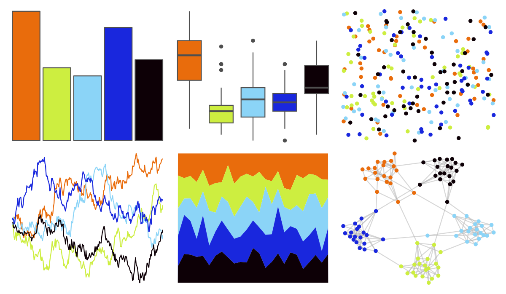

# fishualize - Acanthurus_sohal 

::: columns
::: {.column width="50%"}

**Github**

[nschiett/fishualize](https://github.com/nschiett/fishualize)
:::

::: {.column width="50%"}

**CRAN**

[fishualize](https://CRAN.R-project.org/package=fishualize)
:::
:::

<hr> 

Use with [paletteer](https://emilhvitfeldt.github.io/paletteer/) package:

```r
library(paletteer)
paletteer_d("fishualize::Acanthurus_sohal")
```

Use raw:

```r
c("#E96C0CFF", "#CDEE40FF", "#8BD4F7FF", "#1927DDFF", "#0D0006FF")
``` 

 

<br>

# Related Palettes

<div class="list" style="display: grid; grid-template-columns: auto auto auto;"> <figure class="figure">
<a href="../../awtools/a_palette/"> </a>
</figure> <figure class="figure">
<a href="../../lisa/RoyLichtenstein/"> </a>
</figure> <figure class="figure">
<a href="../../jcolors/pal2/"> </a>
</figure> <figure class="figure">
<a href="../../fishualize/Cephalopholis_argus/"> </a>
</figure> <figure class="figure">
<a href="../../fishualize/Paracanthurus_hepatus/"> </a>
</figure> <figure class="figure">
<a href="../../fishualize/Scarus_tricolor/"> </a>
</figure> <figure class="figure">
<a href="../../ggthemes/calc/"> </a>
</figure> <figure class="figure">
<a href="../../jcolors/rainbow/"> </a>
</figure> <figure class="figure">
<a href="../../MetBrewer/Lakota/"> </a>
</figure> <figure class="figure">
<a href="../../jcolors/default/"> </a>
</figure> <figure class="figure">
<a href="../../fishualize/Pomacanthus_paru/"> </a>
</figure> <figure class="figure">
<a href="../../awtools/spalette/"> </a>
</figure> 
</div>
