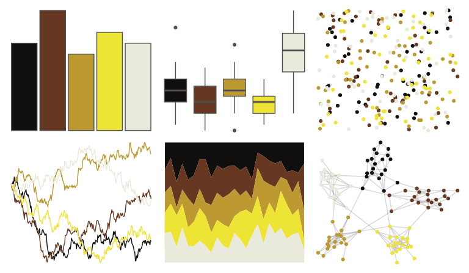

# fishualize - Acanthurus_triostegus 

::: columns
::: {.column width="50%"}

**Github**

[nschiett/fishualize](https://github.com/nschiett/fishualize)
:::

::: {.column width="50%"}

**CRAN**

[fishualize](https://CRAN.R-project.org/package=fishualize)
:::
:::

<hr> 

Use with [paletteer](https://emilhvitfeldt.github.io/paletteer/) package:

```r
library(paletteer)
paletteer_d("fishualize::Acanthurus_triostegus")
```

Use raw:

```r
c("#110F0EFF", "#673821FF", "#BD9931FF", "#EEE436FF", "#E9E9DCFF")
``` 

 

<br>

# Related Palettes

<div class="list" style="display: grid; grid-template-columns: auto auto auto;"> <figure class="figure">
<a href="../../awtools/a_palette/"> </a>
</figure> <figure class="figure">
<a href="../../colRoz/p_mitchelli/"> </a>
</figure> <figure class="figure">
<a href="../../colRoz/s_spinigerus/"> </a>
</figure> <figure class="figure">
<a href="../../lisa/FridaKahlo/"> </a>
</figure> <figure class="figure">
<a href="../../tvthemes/Topaz/"> </a>
</figure> <figure class="figure">
<a href="../../fishualize/Chaetodon_ephippium/"> </a>
</figure> <figure class="figure">
<a href="../../fishualize/Neogobius_melanostomus/"> </a>
</figure> <figure class="figure">
<a href="../../fishualize/Ostracion_cubicus/"> </a>
</figure> <figure class="figure">
<a href="../../soilpalettes/rendoll/"> </a>
</figure> <figure class="figure">
<a href="../../yarrr/ohbrother/"> </a>
</figure> <figure class="figure">
<a href="../../beyonce/X16/"> </a>
</figure> <figure class="figure">
<a href="../../futurevisions/earth/"> </a>
</figure> 
</div>
