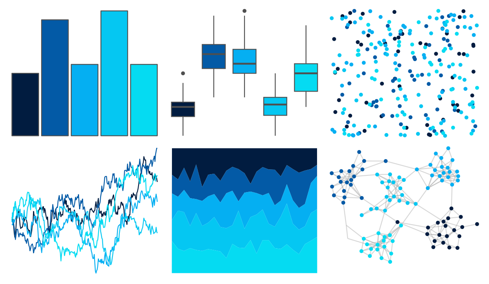

# fishualize - Aluterus_scriptus 

::: columns
::: {.column width="50%"}

**Github**

[nschiett/fishualize](https://github.com/nschiett/fishualize)
:::

::: {.column width="50%"}

**CRAN**

[fishualize](https://CRAN.R-project.org/package=fishualize)
:::
:::

<hr> 

Use with [paletteer](https://emilhvitfeldt.github.io/paletteer/) package:

```r
library(paletteer)
paletteer_d("fishualize::Aluterus_scriptus")
```

Use raw:

```r
c("#011C40FF", "#035AA6FF", "#05AFF2FF", "#05C7F2FF", "#05DBF2FF")
``` 

 

<br>

# Related Palettes

<div class="list" style="display: grid; grid-template-columns: auto auto auto;"> <figure class="figure">
<a href="../../amerika/Dem_Ind_Rep3/"> </a>
</figure> <figure class="figure">
<a href="../../fishualize/Prionace_glauca/"> </a>
</figure> <figure class="figure">
<a href="../../LaCroixColoR/Pure/"> </a>
</figure> <figure class="figure">
<a href="../../fishualize/Halichoeres_brasiliensis/"> </a>
</figure> <figure class="figure">
<a href="../../NatParksPalettes/Glacier/"> </a>
</figure> <figure class="figure">
<a href="../../fishualize/Chlorurus_microrhinos/"> </a>
</figure> <figure class="figure">
<a href="../../poisonfrogs/Oploma/"> </a>
</figure> <figure class="figure">
<a href="../../PrettyCols/Ocean/"> </a>
</figure> <figure class="figure">
<a href="../../ggsci/cyan_bs5/"> </a>
</figure> <figure class="figure">
<a href="../../ggsci/sky_tw3/"> </a>
</figure> <figure class="figure">
<a href="../../ButterflyColors/archaeoprepona_demophon_thalpius/"> </a>
</figure> <figure class="figure">
<a href="../../ggsci/blue_bs5/"> </a>
</figure> 
</div>
