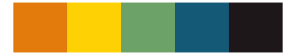
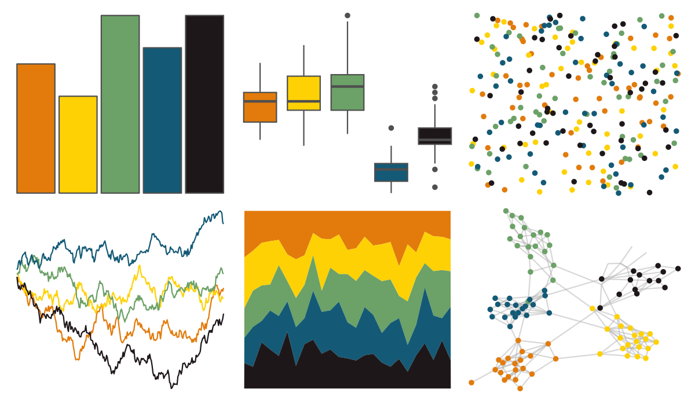
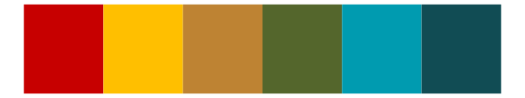

# fishualize - Balistapus_undulatus 

::: columns
::: {.column width="50%"}

**Github**

[nschiett/fishualize](https://github.com/nschiett/fishualize)
:::

::: {.column width="50%"}

**CRAN**

[fishualize](https://CRAN.R-project.org/package=fishualize)
:::
:::

<hr> 

Use with [paletteer](https://emilhvitfeldt.github.io/paletteer/) package:

```r
library(paletteer)
paletteer_d("fishualize::Balistapus_undulatus")
```

Use raw:

```r
c("#E27B0CFF", "#FED105FF", "#6CA167FF", "#145A76FF", "#1E1719FF")
``` 

 

<br>

# Related Palettes

<div class="list" style="display: grid; grid-template-columns: auto auto auto;"> <figure class="figure">
<a href="../../awtools/a_palette/"> </a>
</figure> <figure class="figure">
<a href="../../ButterflyColors/hamadryas_feronia/"> </a>
</figure> <figure class="figure">
<a href="../../ButterflyColors/hamadryas_feronia/"> </a>
</figure> <figure class="figure">
<a href="../../MetBrewer/Lakota/"> </a>
</figure> <figure class="figure">
<a href="../../colRoz/virgo/"> </a>
</figure> <figure class="figure">
<a href="../../fishualize/Coris_gaimard/"> </a>
</figure> <figure class="figure">
<a href="../../werpals/small_world/"> </a>
</figure> <figure class="figure">
<a href="../../fishualize/Halichoeres_garnoti/"> </a>
</figure> <figure class="figure">
<a href="../../lisa/GeneDavis/"> </a>
</figure> <figure class="figure">
<a href="../../fishualize/Koumansetta_rainfordi/"> </a>
</figure> <figure class="figure">
<a href="../../calecopal/kelp1/"> </a>
</figure> <figure class="figure">
<a href="../../ochRe/lorikeet/"> </a>
</figure> 
</div>
