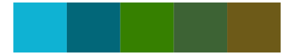

# fishualize - Balistes_vetula 

::: columns
::: {.column width="50%"}

**Github**

[nschiett/fishualize](https://github.com/nschiett/fishualize)
:::

::: {.column width="50%"}

**CRAN**

[fishualize](https://CRAN.R-project.org/package=fishualize)
:::
:::

<hr> 

Use with [paletteer](https://emilhvitfeldt.github.io/paletteer/) package:

```r
library(paletteer)
paletteer_d("fishualize::Balistes_vetula")
```

Use raw:

```r
c("#0086DAFF", "#0468BFFF", "#009BECFF", "#A29641FF", "#9E8430FF")
``` 

 

<br>

# Related Palettes

<div class="list" style="display: grid; grid-template-columns: auto auto auto;"> <figure class="figure">
<a href="../../awtools/a_palette/"> </a>
</figure> <figure class="figure">
<a href="../../fishualize/Taeniura_lymma/"> </a>
</figure> <figure class="figure">
<a href="../../fishualize/Scarus_zelindae/"> </a>
</figure> <figure class="figure">
<a href="../../fishualize/Halichoeres_dimidiatus/"> </a>
</figure> <figure class="figure">
<a href="../../calecopal/bixby/"> </a>
</figure> <figure class="figure">
<a href="../../NatParksPalettes/Everglades/"> </a>
</figure> <figure class="figure">
<a href="../../calecopal/kelp2/"> </a>
</figure> <figure class="figure">
<a href="../../beyonce/X40/"> </a>
</figure> <figure class="figure">
<a href="../../fishualize/Hamulon_plumieri/"> </a>
</figure> <figure class="figure">
<a href="../../MetBrewer/Isfahan1/"> </a>
</figure> <figure class="figure">
<a href="../../MetBrewer/Veronese/"> </a>
</figure> <figure class="figure">
<a href="../../nbapalettes/pacers_foundation/"> </a>
</figure> 
</div>
