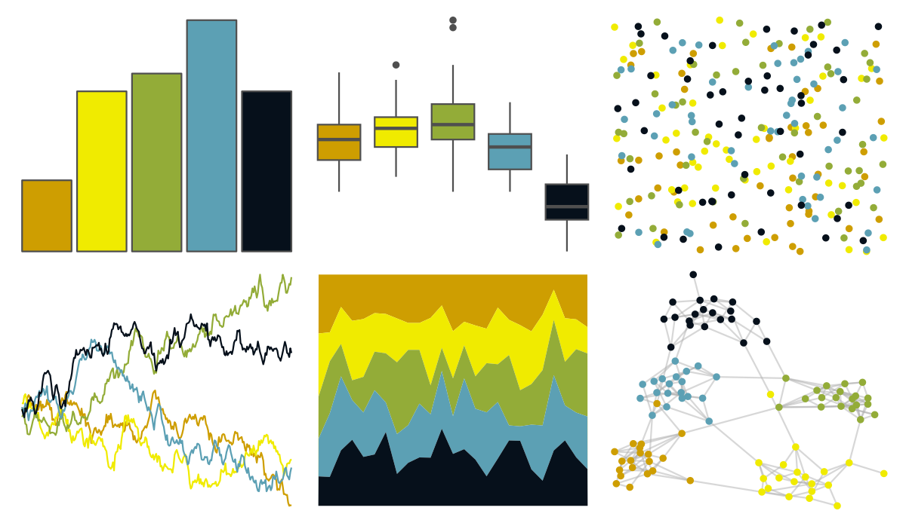

# fishualize - Balistoides_conspicillum 

::: columns
::: {.column width="50%"}

**Github**

[nschiett/fishualize](https://github.com/nschiett/fishualize)
:::

::: {.column width="50%"}

**CRAN**

[fishualize](https://CRAN.R-project.org/package=fishualize)
:::
:::

<hr> 

Use with [paletteer](https://emilhvitfeldt.github.io/paletteer/) package:

```r
library(paletteer)
paletteer_d("fishualize::Balistoides_conspicillum")
```

Use raw:

```r
c("#CE9E01FF", "#F0EB00FF", "#93AC38FF", "#5CA0B4FF", "#06101BFF")
``` 

 

<br>

# Related Palettes

<div class="list" style="display: grid; grid-template-columns: auto auto auto;"> <figure class="figure">
<a href="../../awtools/a_palette/"> </a>
</figure> <figure class="figure">
<a href="../../ButterflyColors/hamadryas_feronia/"> </a>
</figure> <figure class="figure">
<a href="../../ButterflyColors/hamadryas_feronia/"> </a>
</figure> <figure class="figure">
<a href="../../fishualize/Halichoeres_garnoti/"> </a>
</figure> <figure class="figure">
<a href="../../fishualize/Rhinecanthus_aculeatus/"> </a>
</figure> <figure class="figure">
<a href="../../fishualize/Thalassoma_pavo/"> </a>
</figure> <figure class="figure">
<a href="../../feathers/bee_eater/"> </a>
</figure> <figure class="figure">
<a href="../../fishualize/Hypoplectrus_puella/"> </a>
</figure> <figure class="figure">
<a href="../../fishualize/Neogobius_melanostomus/"> </a>
</figure> <figure class="figure">
<a href="../../fishualize/Balistapus_undulatus/"> </a>
</figure> <figure class="figure">
<a href="../../fishualize/Chaetodontoplus_conspicillatus/"> </a>
</figure> <figure class="figure">
<a href="../../fishualize/Ostracion_cubicus/"> </a>
</figure> 
</div>
