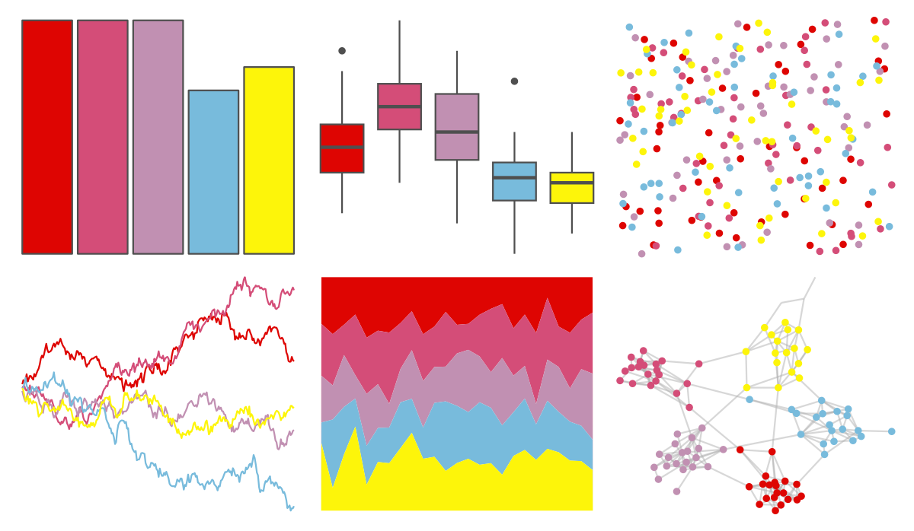

# fishualize - Bodianus_pulchellus 

::: columns
::: {.column width="50%"}

**Github**

[nschiett/fishualize](https://github.com/nschiett/fishualize)
:::

::: {.column width="50%"}

**CRAN**

[fishualize](https://CRAN.R-project.org/package=fishualize)
:::
:::

<hr> 

Use with [paletteer](https://emilhvitfeldt.github.io/paletteer/) package:

```r
library(paletteer)
paletteer_d("fishualize::Bodianus_pulchellus")
```

Use raw:

```r
c("#DE0502FF", "#D44D78FF", "#C190B2FF", "#78BBDCFF", "#FDF50AFF")
``` 

 

<br>

# Related Palettes

<div class="list" style="display: grid; grid-template-columns: auto auto auto;"> <figure class="figure">
<a href="../../awtools/a_palette/"> </a>
</figure> <figure class="figure">
<a href="../../ButterflyColors/hamadryas_feronia/"> </a>
</figure> <figure class="figure">
<a href="../../ButterflyColors/hamadryas_feronia/"> </a>
</figure> <figure class="figure">
<a href="../../PrettyCols/Lucent/"> </a>
</figure> <figure class="figure">
<a href="../../MoMAColors/Koons/"> </a>
</figure> <figure class="figure">
<a href="../../fishualize/Nemateleotris_magnifica/"> </a>
</figure> <figure class="figure">
<a href="../../ltc/kiss/"> </a>
</figure> <figure class="figure">
<a href="../../waRhol/the_big_c_86/"> </a>
</figure> <figure class="figure">
<a href="../../fishualize/Callanthias_australis/"> </a>
</figure> <figure class="figure">
<a href="../../waRhol/marilyn_orange_62/"> </a>
</figure> <figure class="figure">
<a href="../../ggthemes/excel_Ion/"> </a>
</figure> <figure class="figure">
<a href="../../lisa/JamesJean/"> </a>
</figure> 
</div>
