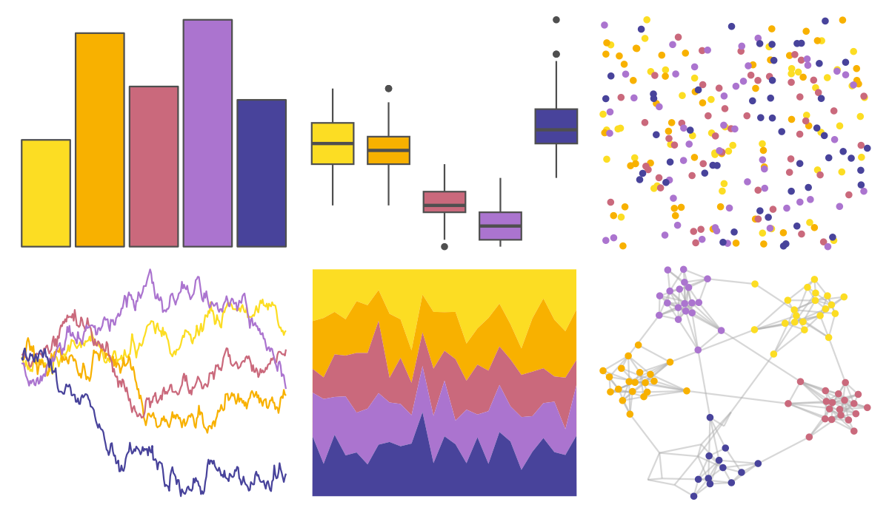

# fishualize - Bodianus_rufus 

::: columns
::: {.column width="50%"}

**Github**

[nschiett/fishualize](https://github.com/nschiett/fishualize)
:::

::: {.column width="50%"}

**CRAN**

[fishualize](https://CRAN.R-project.org/package=fishualize)
:::
:::

<hr> 

Use with [paletteer](https://emilhvitfeldt.github.io/paletteer/) package:

```r
library(paletteer)
paletteer_d("fishualize::Bodianus_rufus")
```

Use raw:

```r
c("#FCDD23FF", "#F8B100FF", "#CA697CFF", "#AB74CFFF", "#48439BFF")
``` 

 

<br>

# Related Palettes

<div class="list" style="display: grid; grid-template-columns: auto auto auto;"> <figure class="figure">
<a href="../../awtools/a_palette/"> </a>
</figure> <figure class="figure">
<a href="../../nationalparkcolors/DeathValley/"> </a>
</figure> <figure class="figure">
<a href="../../lisa/JamesRosenquist/"> </a>
</figure> <figure class="figure">
<a href="../../lisa/WassilyKandinsky_2/"> </a>
</figure> <figure class="figure">
<a href="../../lisa/EdvardMunch/"> </a>
</figure> <figure class="figure">
<a href="../../rcartocolor/Sunset/"> </a>
</figure> <figure class="figure">
<a href="../../lisa/GustavKlimt/"> </a>
</figure> <figure class="figure">
<a href="../../fishualize/Callanthias_australis/"> </a>
</figure> <figure class="figure">
<a href="../../ggthemes/excel_Parallax/"> </a>
</figure> <figure class="figure">
<a href="../../nbapalettes/pacers_foundation/"> </a>
</figure> <figure class="figure">
<a href="../../ggsci/default_nejm/"> </a>
</figure> <figure class="figure">
<a href="../../fishualize/Pronotogrammus_martinicensis/"> </a>
</figure> 
</div>
