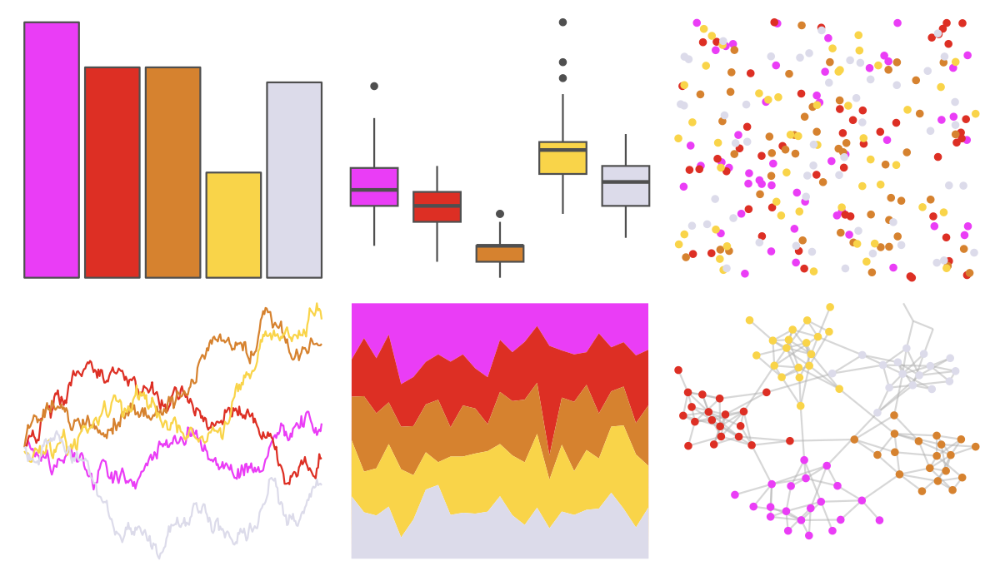
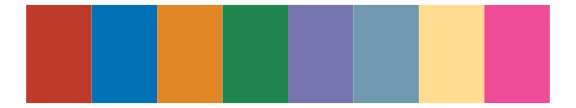
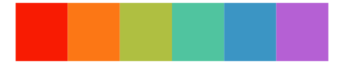

# fishualize - Bryaninops_natans 

::: columns
::: {.column width="50%"}

**Github**

[nschiett/fishualize](https://github.com/nschiett/fishualize)
:::

::: {.column width="50%"}

**CRAN**

[fishualize](https://CRAN.R-project.org/package=fishualize)
:::
:::

<hr> 

Use with [paletteer](https://emilhvitfeldt.github.io/paletteer/) package:

```r
library(paletteer)
paletteer_d("fishualize::Bryaninops_natans")
```

Use raw:

```r
c("#EA3DF6FF", "#DD2F24FF", "#D6822FFF", "#F9D449FF", "#DCDBEAFF")
``` 

 

<br>

# Related Palettes

<div class="list" style="display: grid; grid-template-columns: auto auto auto;"> <figure class="figure">
<a href="../../amerika/Dem_Ind_Rep3/"> </a>
</figure> <figure class="figure">
<a href="../../fishualize/Callanthias_australis/"> </a>
</figure> <figure class="figure">
<a href="../../ggthemes/excel_Berlin/"> </a>
</figure> <figure class="figure">
<a href="../../wesanderson/Royal1/"> </a>
</figure> <figure class="figure">
<a href="../../ggsci/default_nejm/"> </a>
</figure> <figure class="figure">
<a href="../../ggthemes/excel_Atlas/"> </a>
</figure> <figure class="figure">
<a href="../../rcartocolor/Sunset/"> </a>
</figure> <figure class="figure">
<a href="../../ggthemes/excel_Parallax/"> </a>
</figure> <figure class="figure">
<a href="../../yarrr/xmen/"> </a>
</figure> <figure class="figure">
<a href="../../trekcolors/lcars_2369/"> </a>
</figure> <figure class="figure">
<a href="../../fishualize/Nemateleotris_magnifica/"> </a>
</figure> <figure class="figure">
<a href="../../fishualize/Bodianus_pulchellus/"> </a>
</figure> 
</div>
